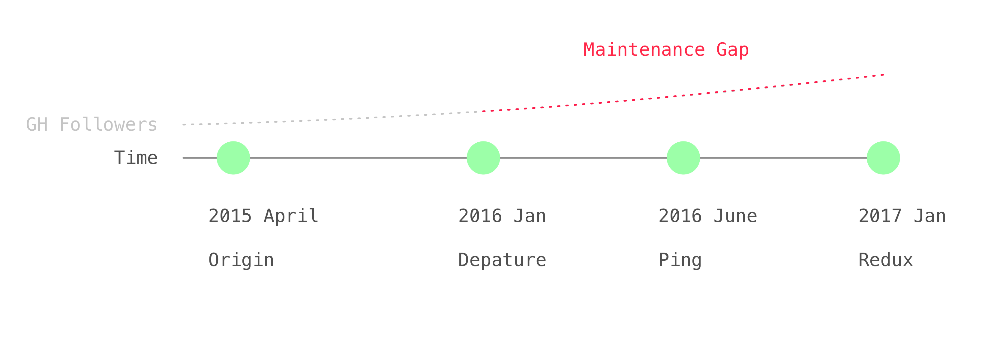
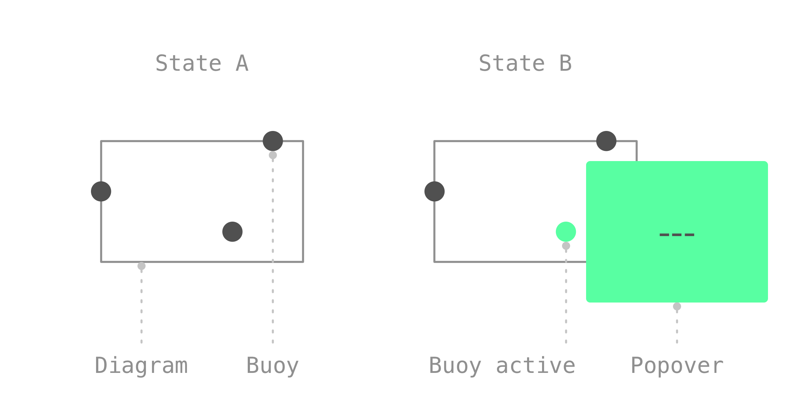

# Reviving React Popover

This is a tiny story about a tiny project I worked on at littleBits which grew a tiny following and that I’ve been given back write access to recently. Be warned this will probably a very mundane tale to you, but for me personally it was worth writing as I buckle back into the project.

A few years ago while I was still toiling away at littleBits I worked on a particular mission with Colin Vernon (product), Shem (design), Alin Cosmanescu (electrical engineering), and others, to improve the the cloudBit on-boarding user experience. One of the many tasks was to improve the littleBits circuit diagrams we used for our setup instructions. We wanted them to communicate more directly via improved animation and interactive buoys highlighting key sections with additional details. Once selected, a popover would open around the buoy.

This is a story about that popover.

We wanted a flexible system. I set the bar high by committing to creating something that would adapt to arbitrary diagrams with arbitrary buoy placements in arbitrary layout contexts. In other words an algorithm smart enough to automatically find the best possible position for a given popover.
We called this component react-popover and open-sourced it. This was not the first time littleBits had open-sourced, as it fostered a culture that balanced internal needs with the value of technology openness and sharing. Props!
Fast forward roughly nine months and enter 2016. I had moved on from littleBits. My ex-colleague Adrian Schaedle asked if I wanted to stay onboard with the open-source work I had done there but my personal priorities had changed as I became busy with other things like pursing my interest in Haskell, welcoming my second child to Mother Earth (!) and just generally taking a long overdue break.

Throughout 2016 a tiny community organically grew around react-popover despite low maintenance around the project. For myself, by autumn my financial realities had caught up and job hunt replaced Canadian paternity leave. I was not yet adept with Haskell so returned to comfortable territory: JavaScript, react, devOps, full stack, etc. Suddenly maintaining a library like react-popover had renewed relevancy to me too. I inquired about getting back involved but it seemed the timing wasn’t quite right for all parties.

Fast forward again, enter 2017. One day, quite ordinary and nothing particular, I see on Github that Adrian Schaedle has added me back as an admin! Yay. Thank you Adrian and littleBits. Not all companies are places where you can work on open-source, and fewer yet are open enough to welcome external contributors.

Jumping back into most any project after two years is likely to be non-trivial; react-popover is no exception. While there are decent user-docs and a few demos the the code itself is written by a former me which software engineers will probably acknowledge can sometimes seem like it might as well be another person. In this case that “other person” seems to have been writing some rather suspect code… …git blame… *!#$^ Jason! The salient issues I’ve found are:

* lack of abstraction and generally complicated
* procedural code including fidgety layout logic
* no static types
* no tests

To rebuild my confidence and command of the codebase I have decided to carefully review the library’s core purpose: algorithmic layout. Specifically I want to clearly capture what it aims to achieve by using visual diagrams that illustrate how rules play out in various cases footnote:[At first my diagrams will be static however I am interested in making them “live”, not unlike the diagrams found in essays by Bret Victor.]. Not only will this be valuable for me now to reestablish my connection to the project but I think it could:

* help users understand the library
* make it easier to implement a similar/same component in other UI frameworks e.g. Cycle
* ease future maintenance because a good visual reference aids comprehending what dense layout code and the various domain terms are trying to achieve

My review and accompanying diagrams will be published in the next few days.
