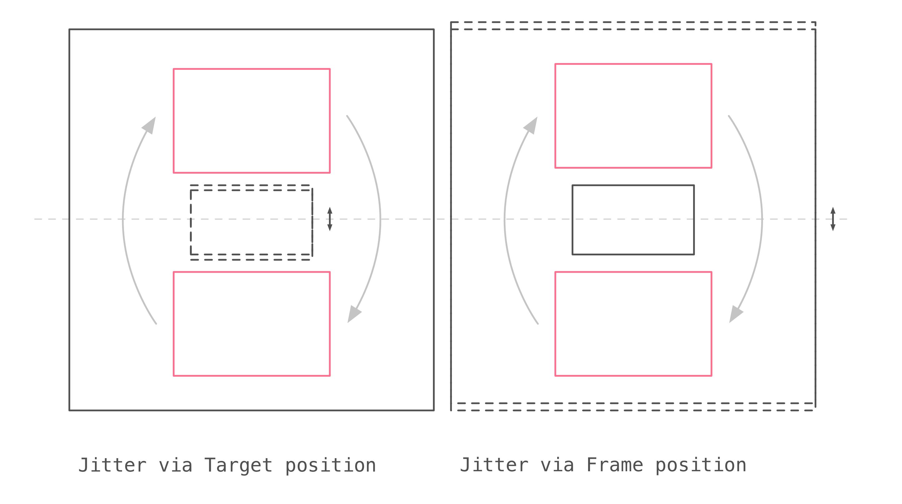

:toc: macro
:toc-title:
:sectanchors:
:toclevels: 99

# Parc: The layout engine powering React Popover

image::zones.png[]

This is a technical document regarding Parc, the layout system powering react-popover. If you are generally curious about what react-popover is, why it exists, etc. then you may want to read a link:/1-react-popover-history/README.adoc[recent article detailing its back-story].

toc::[]

## Introduction

Parc is a two dimensional layout system. It is specifically designed to find the optimal position of Popover in relation to Target and Frame. Parc only needs minimal knowledge of these components to function correctly: Their coordinates, dimensions, and (for Tip only) directionality. The following diagram is an introductory view of these components and how the system works toward a final result.

image::introduction.png[]

Parc has its roots in a project that began as a quick idea and hasty implementation almost two years ago. It is ad hoc in that it lacks any formal methods such as mathematical proofs. It is also not a general layout system (e.g. https://www.w3.org/TR/css-flexbox-1[Flex]) but rather purpose built. These limitations arise from my practical limits in resources and knowledge. I do not claim my system is innovative or better than X. I am in awe at systems like http://constraints.cs.washington.edu/web/ccss-uwtr.pdf[Constraint Cascading Style Sheets for the Web] and http://overconstrained.io/[Cassowary]. Parc is just my humble contribution to this vast world. If you have an idea about how to improve Parc, I would welcome your contributions on Github!

## The Algorithm

### Phase 1: Calculate the optimal zone

The first major action Parc takes is to determine which zone to position Popover within. This calculation is separated into three steps: Measure how each zone fits the popover; Rank each fit to find the optimal zone; Determine if the difference between new zone and old zone merits a change.

##### Step 1: Measure

By default all zones are eligible for consideration but the user is able to change this selection explicitly using one of the following choices: vertical, horizontal, before, after, top, bottom, left, right.

For each eligible zone Parc subtracts Popover's height and width from the zone's height and width. When doing this Parc also has to correctly account for the Tip's main-axis length. The result is knowing how much spare space each zone would have along either dimension after fitting Popover. It is referred to as the zone's _fit_.

_Note: See <<app-b>> for a deep dive on a fun edge case I encountered while spiking the initial implementation two years ago._

##### Step 2: Rank

Parc groups the measured zones into first or second class. First class zones are those whose fit is positive on both dimensions. Second class zones are those whose fit is negative on one or both dimensions.

If there are first class zones then Parc picks the one with the greatest area. The only exception is if the user has specified a preferred zone which is in the first class set and whose threshold of not having another zone of n-percent greater area is met; In which case the preferred zone is used (even if it does not have the greatest area).

Otherwise if there are only second class zones, pick the one with least percentage area cropped (exceeding Frame bounds). Again the only exception is if the user has specified a preferred zone. The same logic applies as before but here the threshold is about not having another zone of n-percent _less_ area cropped.

##### Step 3: Threshold

With a zone selected Parc checks if between that zone and the previous zone *as measured now* there exists sufficient improvement to warrant rezoning. If so Parc will proceed with the selected zone, otherwise with the previous zone.

* Proceed with selected zone:
** If initial render (since the there is no previous zone)
** If it's the same zone as previous
** If it's first class and previous zone is second class
* Otherwise check if selected zone has a sufficiently greater fit than previous zone. If yes then proceed with selected zone, otherwise proceed with previous zone.

_Note: For a discussion on why rezone thresholds are useful see <<app-c>>._

##### An Example

In the following diagram (<<zmd, see glossary for how to read these>>) see how the measuring and ranking play out. Interestingly, the right zone has greater remaining length available than the bottom zone yet it's ranked lower. This is because the right zone would have Popover exceed frame bounds while the bottom would not. The right zone is an example of second class.

image::zone-measure.png[]

### Phase 2: Position the Popover

#### Pursue cross-axis center alignment

With the optimal zone found Parc can now calculate the best position for Popover within it. Parc seeks the position of Popover that would see its cross-axis center matched to the that of Target _within Frame_.

image::positioning.png[]

#### Handle cropped Targets

Target _within Frame_ means that any Target length outside the Frame bounds is ignored when calculating Target center.

This approach to centering generally produces more harmonious results in the author's opinion. However should use-cases arise where absolute center is more desirable I think support for configuration here would be relatively easy.

#### Handle cropped Popovers

When matching center points would make it impossible for Popover to remain within Frame bounds then one of several strategies may be applied. Exactly which one depends upon what the user has chosen ahead of time.

##### Mode Bounded

Position Popover up to the Frame bounds but not beyond them.

image::positioning-bounded.png[]

##### Mode Unbounded

Frame bounds are ignored. Note that Popover is still positioned to the Target's in-Frame center; It may turn out that in this mode absolute center is actually more desirable, but I'm not sure. Maybe my opinion will change with feedback and examples from real-world usage.

image::positioning-unbounded.png[]

### Phase 3: Position the Tip

With the Popover's position found within the optimal zone Parc can now proceed with the last step: position the Tip. To do this correctly Parc assumes that Tip is pointing upward at zero degrees rotation. Its layout rules are as follows:

. Face the target.
. Along main-axis: position between Popover and Target.
. Along cross-axis: position centered between the two nearest cross-sides amongst Target and Popover:

image::tip-centering.png[]

## Conclusion

At this point the optimal position of Popover as governed by our ruleset has been reached. Should the dimensions of any component change (including Popover itself), or should the coordinates of Target or Frame change, then Parc will need to run again to find Popover's revised position.

### Future Work

One current limitation of Parc is that it only supports rectangular shaped components. Support for arbitrarily shapes would probably greatly increase Parc's complexity, though it sure sounds like a fun challenge :). It wouldn't surprise me if I were to find relevant algorithm(s) for the arising problems from mature graphics-heavy industries like video games.

Another limitation is that Tip is a "hardcoded" idea. Parc could would become significantly more general if it could be factored out somehow. It would be easy enough to add a configuration option to simply disable Tip, but while pragmatic that's not my ideal. Instead I would prefer to make Parc fully unaware of Tip, yet somehow make it easy to _compose_ the idea of Tip into an instance of this system. Such a solution would probably tend toward a general layout solver (e.g. https://gridstylesheets.org[GSS]) in which case my ideal solution would be, at best, a long-term goal.

One meta improvement I'm interested in is to create enhanced versions of the diagrams found in this article, such that they are interactive and "live" a la http://worrydream.com/#!2/LadderOfAbstraction[Bret Victor's essays]. Parc is a complex system that can lead to all sorts of results for all sorts of reasons. Static diagrams do not communicate this well which I think may slow or prevent deep understanding and new insights amongst both users and myself.

## Appendices

### Appendix A: Examples

image::examples.png[]

[[app-b]]
### Appendix B: Factoring in Tip's main length, an interesting edge case

Observe that Tip length affects either height or width of Popover depending upon the orientation of a zone. As such zones of opposite orientation manifest slightly different Popover dimensions. If not handled right this can trigger an infinite layout loop between two second-class zones of opposite orientation. This is because said change in dimension will affect the percentage of Popover cropped and in turn lead to always another zone appearing superior than the current one. The following diagram helps illustrate this:

image::infini-loop.png[]

1. Popover positioned via either initial render or some previous lead up. Dimensions change because of Tip movement
2. A new optimal zone in first class is detected
3. Popover positioned. Dimensions change because of Tip movement
4. A new optimal zone in first class is detected; Go to 1

My solution to this problem is to make sure Parc always adds the Tip's main-axis length to Popover's main-axis length when calculating a zone's fit rank. For example for top zone add Tip length to the Popover height; for right zone add Tip length to Popover width; etc. The scenario from before now looks like:

image::infini-loop-fixed.png[]

1. Popover positioned via either initial render or some previous lead up
2. Some change triggers a layout scan, another zone is closely ranked but given that its in the same class and has a fit as bad or worse than current position, the latter is maintained.

Its worth pointing out that rezone thresholds could mask this problem in some cases but they would never amount to a general solution nor would they ever help the class-upgrade case diagramed here (remember Popovers are always rezoned if it means a class-upgrade).

[[app-c]]
### Appendix C: The usefulness of rezone thresholds

Rezone thresholds are useful in at least two ways. First, in preventing rezoning jitter which stems from cases where the set of zones are tightly ranked and so correspondingly tiny fluctuations in the arrangement would likely alter rankings. Second, to balance the needs of ideal layout with that of user experience where the presumption is that an occasionally rezoning Popover may be jarring to the user and therefore undesirable.

A minimal threshold is enough to guard against jitter. In the following diagram you can imagine the Target might be some kind of draggable, while the Frame might be some kind of scrollable. Without thresholds jitter in either would propagate to the Popover.

A large threshold can limit rezones in the face of correspondingly sized changes to the arrangement. In the following diagram you can see how Popover will not rezone until there is another zone three times greater in area.

image::change-threshold-75.png[]

An "infinite" threshold can disable most rezones altogether. In the following diagram you can see how there is no rezone until not doing so would mean being outside the Frame bounds (AKA a class-upgrade is available).

image::change-threshold-100.png[]

## Glossary

### Components

Target :: A rectangular thing. The aim of Popover.

Frame :: The rectangular bounding box that Popover should remain within.

Popover :: The rectangular thing Parc is optimally positioning in relation to Target and Frame.

Tip :: A visual cue reflecting Popover's aim. It is positioned relative to Popover and Target.

### Layout

image::anatomy-layout.png[]

Arrangement :: The current position and dimensions of Target, Frame, and Popover.

Main/Cross Axes :: Relative axes whose concrete orientation depend upon Popover's position relative to Target. The main-axis is along the orientation containing Popover adjacent to Target while the cross-axis is along that which does not cross through both Target and Popover.

Before/After Sides :: Way to think about sides without specifying the orientation. _Before_ refers to top or left. _After_ refers to bottom or right footnote:[The choice of mapping "before" to "top" as opposed to "bottom" reflects the coordinate system on the web where 0,0 is top-left. To people familiar with Math, Adobe Flash, or other environments, this is unnatural but alas I took the expedient approach by staying consistent with the web.].

Zone :: A rectangle between the inner frame and outer Target. There are four zones between Target and Frame.

Zone Fit :: How well a given zone fits the Popover. Determined by subtracting the Popover's dimensions from that of zone's.

First Class Zone :: A zone whose fit is positive on both dimensions.

Second Class Zone :: A zone whose fit is negative on one or both dimensions.

Rezone thresholds :: A technique to control rezone frequency.

Preferred Zones :: A user configurable option that tweaks the algorithm to prefer particular zones during ranking. The preference is specified as a threshold of how much better can other zones be while preferring these ones. The zones can be expressed as any of: vertical, horizontal, before, after, top, bottom, left, right. By default Parc prefers no zones and just picks whichever is top ranked.

Eligible Zones :: A user configurable option instructing Parc about which zones Popover can be positioned within. The eligible zones can be expressed as any of: vertical, horizontal, before, after, top, bottom, left, right. By default all zones are eligible.

Mode Bounded :: Popover will always try to stay within Frame bounds.

Mode Unbounded :: Popover will ignore Frame bounds.

[[zmd]]
### Zone Measure Diagram

image::zone-measure-legend.png[]
