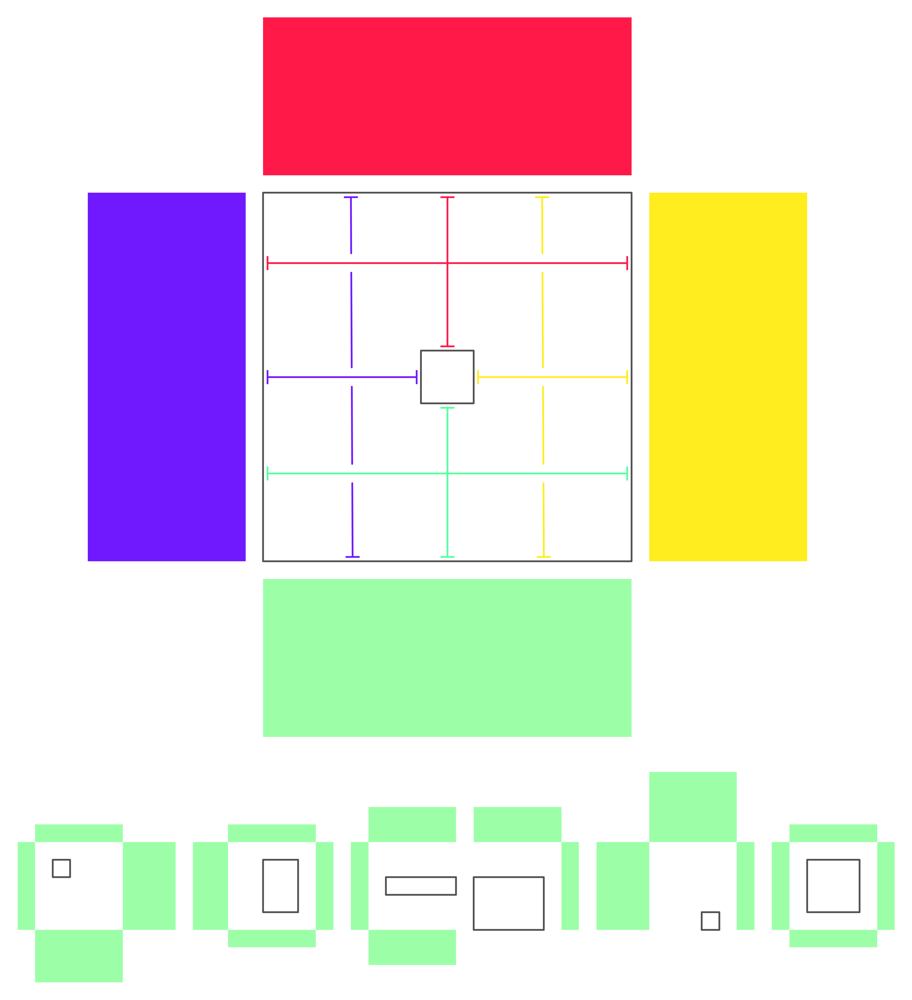
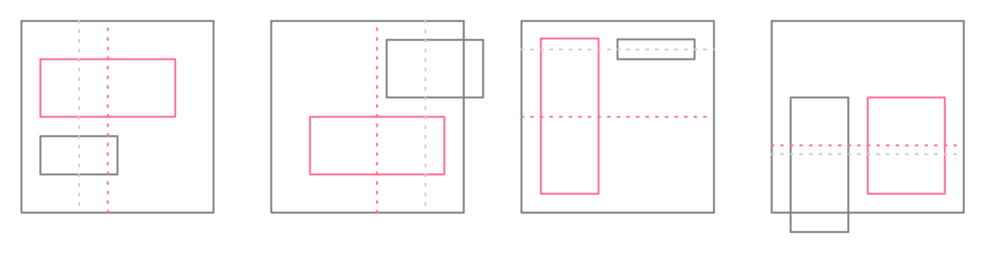
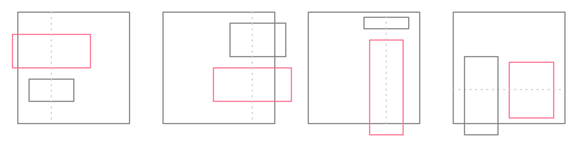
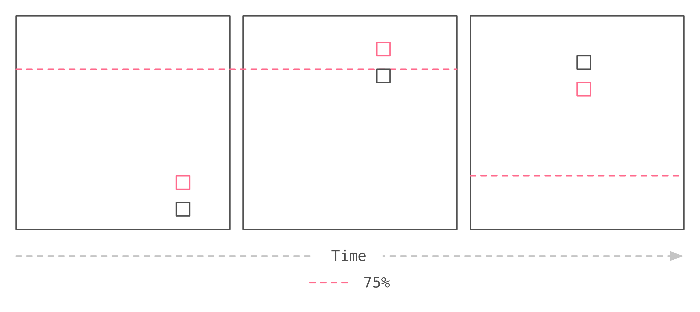

:toc: macro
:toc-title:
:sectanchors:
:toclevels: 99

# The layout system powering React Popover

This is a technical document regarding the layout system powering react-popover. If you are generally curious about what react-popover is, why it exists, etc. then you may want to read a link:/1-react-popover-history/README.adoc[recent article detailing its back-story].

toc::[]

## Introduction

The layout system is designed to find the optimal position of Popover in relation to Target and Frame. The system only needs minimal knowledge of these components to function correctly: Their coordinates, dimensions, and for Tip also its directionality.

This system has its roots in a project that began as a quick idea and hasty implementation almost two years ago. It is informal meaning it lacks any formal methods like mathematical proofs or engineering analysis. It is bespoke meaning it is not a general layout system but rather specific to the combination of Popover, Target, Frame. These limitations arise from my current practical resources and knowledge. I have a background in design and self-taught software development. I am in awe at amazing systems like http://constraints.cs.washington.edu/web/ccss-uwtr.pdf[Constraint Cascading Style Sheets for the Web] and http://overconstrained.io/[Cassowary].  This system is just my humble contribution to this vast world.

## Algorithm

### Phase 1: Calculate the optimal zone

Popover will be positioned within the optimal zone. The algorithm to decide this occurs in three steps: Measure how each zone fits the popover; Rank each fit to find the optimal zone; Determine if the difference between new zone and old zone merits a change.

##### Step 1: Measure

For each zone we subtract Popover's height and width from the zone's height and width. When doing this we also have to factor in the Tip's main-axis length . The result is knowing how much spare space each zone would have along either dimension after fitting Popover. We refer to this result as the zone's "fit".

_Note: See <<app-b>> for a deep dive on a fun edge case I encountered while spiking the initial implementation two years ago._

##### Step 2: Rank

We group zones into first or second class. First class zones are those whose fit is positive on both dimensions. Second class zones are those whose fit is negative on one or both dimensions.

If there are first class zones, we pick the one with the largest area. Otherwise we pick the second class zone with least percentage area exceeding Frame bounds.

##### Step 3: Threshold

With a zone selected we check if between it and the previous zone *as measured now* there exists sufficient improvement to warrant change. If so we will proceed with the selected zone, otherwise with the previous zone.

* Proceed with selected zone:
** If initial render
** If it is still the previous zone
** If it is first class and previous zone is second class.
* Otherwise check if selected zone has a sufficiently greater fit than previous zone. If yes then proceed with selected zone, otherwise proceed with previous zone.

_Note: For a discussion on why change thresholds are useful see <<app-c>>._

##### Example

In the following diagram (<<zmd, legend>>) see how the measuring and ranking play out. Interestingly, the right zone has greater remaining length available than the bottom zone yet is ranked lower. This is because the right zone would have Popover exceed frame bounds while bottom would not. The right zone is an example of second class.

image::zone-measure.png[]

### Phase 2: Position the Popover

With the optimal zone found we can now calculate the best position for Popover within it. Our algorithm looks for the position of Popover that would see its main axis matched to that of Target.

When it is not possible for Popover to remain within Frame bounds then one of several fallback strategies may be applied. Exactly which one depends upon what the user has chosen ahead of time.

##### Mode Bounded

Position Popover up to the Frame bounds but not beyond them.

##### Mode Unbounded

Frame bounds are ignored.

### Phase 3: Position the Tip

With the Popover's position found within the optimal zone we can now proceed with the last step: position the Tip. To do this correctly our system assumes that Tip is pointing upward at zero degrees rotation. Its layout rules are as follows:

. Face the target.
. Along main-axis: position between Popover and Target.
. Along cross-axis: position centered between the two nearest cross-sides amongst Target and Popover:

image::tip-centering.png[]

## Conclusion

At this point the optimal position of Popover as governed by our ruleset has been reached. Should the dimensions of any component change (including Popover itself), or should the coordinates of Target or Frame change, then we will need to rerun this algorithm again to find Popover's next optimal position.

## Appendices

### Appendix A: Examples

[[app-b]]
### Appendix B: Factoring in Tip's main length, an interesting edge case

Observe that that Tip length affects either height or width of Popover depending upon the zone side. As such zones of opposite orientation manifest slightly different Popover dimensions. If not handled right this can trigger an infinite layout loop between two second-class zones of opposite orientation. This is because said change in dimension will affect the percentage of Popover cropped and in turn lead to always another zone appearing superior than the current one. The following diagram helps illustrate this:

image::infini-loop.png[]

1. Popover positioned via either initial render or some previous lead up. Dimensions change because of Tip movement
2. A new optimal zone in first class is detected
3. Popover positioned. Dimensions change because of Tip movement
4. A new optimal zone in first class is detected; Go to 1

Our solution to this problem is to make sure we always add the Tip's main-axis length to Popover's main-axis length when calculating a zone's fit rank. For example for top zone add Tip length to the Popover height; for right zone add Tip length to Popover width; etc. If we revisit the scenario from before it would now look like:

image::infini-loop-fixed.png[]

1. Popover positioned via either initial render or some previous lead up
2. Some change triggers a layout scan, another zone is closely ranked but given that its in the same class and has a fit as bad or worse than current position, the latter is maintained.

[[app-c]]
### Appendix C: The usefulness of change thresholds

Change thresholds are useful in at least two ways. First, in preventing layout jitter which stems from cases where the set of zones are tightly ranked and so correspondingly tiny fluctuations in the arrangement would likely alter rankings. Second, to balance the needs of layout with that of user experience where the presumption is that an occasionally moving Popover is more jarring than a stable one.

A minimal threshold is enough to guard against basic layout jitter. In the following diagram you can imagine the Target might be some kind of draggable, while the Frame might be some kind of scrollable. Without thresholds jitter in either would propagate to the Popover.

image::change-threshold-0.png[]

A large threshold can limit zone changes in the face of correspondingly sized changes to the arrangement. In the following diagram you can see how Popover will not change zones until there is another one of three times greater area.

An "infinite" threshold can disable most zone changes altogether. The following diagram you can see how the zone never changes until not doing so would mean being outside the Frame bounds (AKA a zone upgrade is available).

## Glossary

### Components

image::anatomy-components.png[]

Target :: The aim of Popover.

Frame :: The bounding box that Popover should remain within.

Popover :: The thing we are positioning in relation to these. Our system will automatically position this component in the most optimal way possible.

Tip :: A visual cue reflecting Popover's aim. It is positioned relative to Popover and Target.

### Layout

image::anatomy-layout.png[]

Main/Cross Axes :: Relative axes whose concrete orientation depend upon Popover's position relative to Target. The main axis is along the orientation containing Popover adjacent to Target while the cross axis is along that which does not cross through both Target and Popover.

Before/After Sides :: If we abstract away concrete orientation via main/cross axes then how do we continue thinking about the four sides of a box: top, right, bottom, left? The solution is to to remove their implied orientation and think about order. By prefixing with a relative axis to disambiguate we are freed to generalize the four sides into two: before, after. The former refers to either top or left while the latter to bottom or right footnote:[The choice of mapping "before" to "top" as opposed to "bottom" reflects the coordinate system on the web where 0,0 is top-left. To people familiar with Math, Adobe Flash, or other environments, this is unnatural but alas I took the expedient approach by staying consistent with the web.].

zone :: A rectangle between the inner frame and outer Target. There are four zones between Target and Frame.

Arrangement :: The current position and dimensions of Target, Frame, and Popover.

Zone Fit :: How well a given zone fits the Popover. Determined by subtracting the Popover's dimensions from that of zone's.

First Class Zone :: A zone whose fit is positive on both dimensions.

Second Class Zone :: A zone whose fit is negative on one or both dimensions.

[[zmd]]
### Zone Measure Diagram

image::zone-measure-legend.png[]
