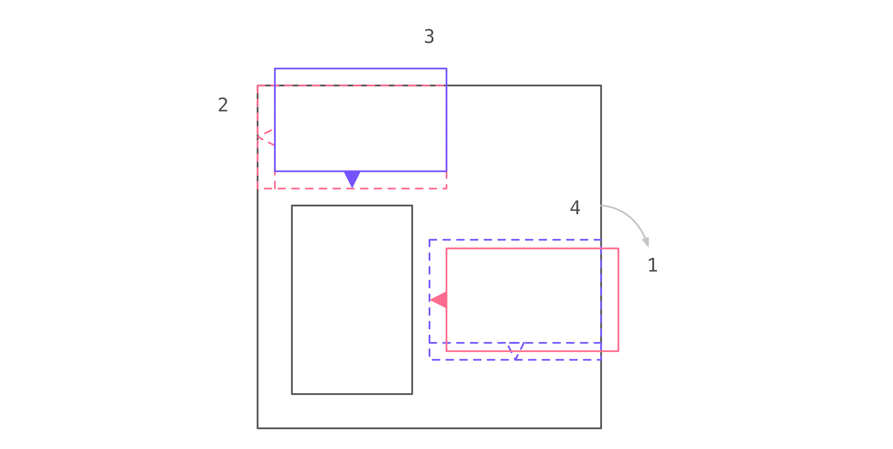

:toc: macro
:toc-title:
:sectanchors:
:toclevels: 99

# React Popover Layout System

image::zones.png[]

This is a technical document regarding the layout system powering react-popover. If you are generally curious about what react-popover is, why it exists, etc. then you may want to read a link:/1-react-popover-history/README.adoc[recent article detailing its back-story].

toc::[]

## Introduction

The layout system's goal is to find the optimal position for Popover in relation to a handful of other distinct components. All it knows about them is their position and dimensions (except Tip where we need to control its directionality too). In minor ways (e.g. terminology) it has been inspired by Flexbox, but generally this system is very much its own original creation.

## Algorithm

### Phase 1: Calculate the optimal zone

Popover will be positioned in the best zone of four. The algorithm to decide this occurs in three steps: Measure how each zone fits the popover; Rank each fit to find the optimal zone; Determine if the difference between new zone and old zone merits a change.

##### Step 1: Measure

For each zone we subtract Popover's height and width from the zone's height and width. When doing this we also have to factor in the Tip's main-axis length (for why this is see <<app-a, appendix A>>). The result is knowing how much spare space each zone would have along either dimension after fitting Popover.

##### Step 2: Rank

We group zones into first or second class. First class zones are those whose fit is positive on both dimensions. Second class zones are those whose fit is negative on one or both dimensions.

Next, if there are first class zones, we pick the one with the largest area. Otherwise we pick the second class zone with least percentage area exceeding Frame bounds.

##### Step 3: Threshold

With a zone selected we check if between it and the current zone there exists sufficient improvement to warrant change. If so we will proceed with the selected zone but otherwise proceed with the current zone.

* If this is the first time we are laying out Popover then proceed with selected zone.
* If selected zone is current zone then proceed with current zone.
* Otherwise check if selected zone has a sufficiently greater size than current zone. If so then proceed with selected zone, otherwise disregard it and instead proceed with current zone.

For a discussion on why change thresholds are useful see <<app-b, appendix B>>.

##### Example

In the following example see how the measuring and ranking play out. Note how the right zone has greater remaining length available than the bottom zone (160 for right versus 150 for bottom) yet because it would have Popover exceed frame bounds its ranking is ultimately lower. The right zone is an example of second class.

image::zone-measure2.png[]

### Phase 2: Position the Popover

With the optimal zone found we can now calculate the best position for Popover within it. Our algorithm looks for the position of Popover that would see its main axis matched to that of Target.

image::positioning-mca.png[]

Popover should generally stay fully within the Frame but when this is not possible a fallback strategy can be applied. There are several different ones we have thought of which the user could choose between depending upon his/her needs.

##### Mode Bounded

Popover may position up to the Frame boundary but not beyond it.

image::positioning-bounded.png[]

##### Mode Unbounded

Popover effectively ignores the Frame

image::positioning-unbounded.png[]

##### Mode Semi-Bounded

Popover is in bounded mode until some percentage of the Target's area exceeds Frame bounds at which point Popover is Unbounded.

image::positioning-semi-bounded.png[]

### Phase 3: Position the Tip

Our system assumes that Tip has a pointer on top and base on bottom. In other words that at rest (no rotation) Tip is pointing upward. Its layout rules are:

. Along main-axis: between Popover and Target
. Along cross-axis: centered between nearest before-side and after-side amongst Target and Popover
. Faces Target

The first rule is straight forward but the second deserves a visualization:

image::tip-centering.png[]

Faces target means that we must rotate Tip depending on which side of Target it finds itself:

image::tip-rotation.png[]

## Examples

image::zone-scenarios2.png[]

## Future Work

##### Bounding Modes

Ideally we can allow the user to design their own bespoke strategy with ease. For example if there were an observable event stream regarding Target's area exceeding Frame bounds then users could execute arbitrary actions at any thresholds, e.g. instead of making Popover enter unbounded mode just close it.

There are also other conceivable factors that could be the basis for more modes including a threshold of Popover's percentage area exceeding bounds (as opposed to the Target).

## Appendices

These appendices cover deep details that underpin reliable layout.

[[app-a]]
### Appendix A: Infinite Loop

When calculating a zone's fit the Tip's contribution to Popover dimensions must be specially handled. If it were not then an infinite loop of zone rank changes could occur in cases involving only second-class options.

##### Problem

Observe that that Tip length affects either height or width of Popover depending upon the zone side. As such zones of opposite orientation manifest slightly different Popover dimensions. If not handled right this can trigger an infinite layout loop between two second-class zones of opposite orientation. Said change in dimension will affect the percentage of crop experienced by Popover in turn leading to always another zone appearing superior than the current one. The following diagram helps illustrate this.

##### Example scenario were we not to account for Tip

1. Popover in place from some previous lead up or just positioned and then dimensions change because of Tip movement
2. A new optimal zone in first class is detected
3. Popover positioned. Dimensions change because of Tip movement
4. A new optimal zone in first class is detected
5. Go to 1...

##### Solution

A non-general solution to this problem is to always add the Tip's main-axis length to Popover's main-axis length when calculating a zone's fit rank. For example for top zone add Tip length to the Popover height; for right zone add Tip length to Popover width; etc.

TODO diagram

If we revisit the scenario from before it would now play out more like the following.

##### Example Scenario when we do account for Tip

image::infini-loop-fixed.png[]

1. Popover in place from some previous lead up
2. Some change triggers a layout scan, another zone is closely ranked but given that its in the same class and exceeds Frame bounds more than in current position, current position remains.
3. Done!

[[app-b]]
### Appendix B: Minimum-improvement Thresholds to prevent layout Jitter

Thresholds are needed to prevent layout jitter (bad for user-experience) caused by zones with tight ranking flipping around the precipice. The diagrams show examples of how minor jitters can be magnified into excessive layout changes.

The underlying problem thresholds solve is that without them we have tightly coupled jitter from the inputs (arrangement, size, etc. of Target, Popover, Frame) to pass right through to our output (zone ranking). Thresholds allow us to define and filter out insignificant zones rank changes, controlling the balance between optimal positioning and layout stability.

Some threshold examples:

* threshold 0.2 means balance stability and positioning: other zones need 20% greater area for change
* threshold 0 means prioritize optimal position: other zones need 1px greater area for change

image::change-threshold-0.png[]

* threshold Infinity means prioritize stability: other zones are never changed to unless it would mean upgrading from second class to first

It may be useful to let users decide if they want to opt-in/out of zone class upgrades thereby limiting criteria for zone changes strictly to their differences in area.

## Glossary

### Components

image::anatomy-components.png[]

##### Target

The aim of Popover.

##### Frame

Frame is the bounding box that Popover should remain within.

##### Popover

The thing we are positioning in relation to these. Our system will automatically position this component in the most optimal way possible.

##### Tip

A visual cue reflecting Popover's aim. It is positioned relative to Popover and Target.

### Layout

image::anatomy-layout.png[]

#### Main/Cross Axes

Relative axes whose concrete orientation depend upon Popover's position relative to Target. The main axis is along the orientation containing Popover adjacent to Target while the cross axis is along that which does not cross through both Target and Popover.

#### Before/After Sides

If we abstract away concrete orientation via main/cross axes then how do we continue thinking about the four sides of a box: top, right, bottom, left? The solution is to to remove their implied orientation and think about order. By prefixing with a relative axis to disambiguate we are freed to generalize the four sides into two: before, after. The former refers to either top or left while the latter to bottom or right footnote:[The choice of mapping "before" to "top" as opposed to "bottom" reflects the coordinate system on the web where 0,0 is top-left. To people familiar with Math, Adobe Flash, or other environments, this is unnatural but alas I took the expedient approach by staying consistent with the web.].

### General

##### zone

A rectangle between the inner frame and outer Target. There are four zones between Target and Frame.

##### Arrangement

The current position and dimensions of Target, Frame, and Popover.
