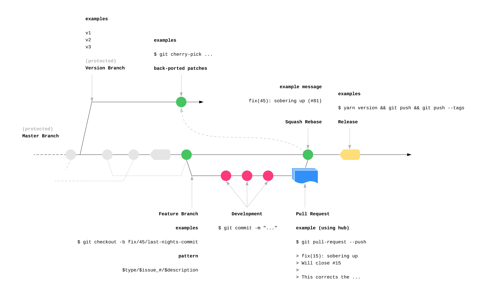

# A workflow that optimizes for simplicity

2018 Feb 19

<!-- TOC START min:2 max:3 link:true update:true -->

* [References](#references)
* [Principals](#principals)
* [Diagram](#diagram)
* [General Rationales](#general-rationales)
  * [Standard](#standard)
  * [Simple](#simple)
* [Particular Rationales](#particular-rationales)
  * [Master as base branch](#master-as-base-branch)
  * [Squash-merge pull-requests (ref)](#squash-merge-pull-requests-ref)
  * [One level of branching (feature branches)](#one-level-of-branching-feature-branches)
  * [Automate flow with natural queues](#automate-flow-with-natural-queues)
* [References](#references)

This is my preferred workflow on software projects. It likely isn't a universal fit for all shapes and sizes but in my experience this or variants of it have worked well for me. This is just a slightly more opionated version of [Github Flow](https://guides.github.com/introduction/flow/).

## Principals

1. **Remove steps**
   Keep thing simple. Complicated or even semi-complicated workflows attempting to "fix" perceived risks may just end up complicating matters by making the surface area for erring even larger. Also the more complicated the process, the greater the risk of dampened collaboration.

2. **Automate steps**
   Do not waste time policing that rules are remembered and followed correctly. We're human. What can go wrong will go wrong. [Murphy told us that](https://en.wikipedia.org/wiki/Murphy%27s_law). Use tooling to stop thinking about this.

3. **Standardize along the cow path**
   Use a simple approach that covers vast majority of cases. Edge cases ought to live in case-by-case procedures, rather than diluting the central pathway.

## General Rationales

### Standard

* Superset of a battle-tested [pattern popularized by Github](https://guides.github.com/introduction/flow/)

* Avoids not-invented-here syndrome.

* Avoids unruly surprises for new engineers to your organization with contemporary expectations while at the same time equipping juniors to quickly redeploy in-house knowledge to the field.

* Can be used for repos both internal and open-source repos

### Simple

* Aligns with the trend toward smaller teams working on smaller repos in microservice architectures.

* Makes developers happy.

* Encourages small quality changes since they're easy to make. If change is laborious expect to see less of it and/or in larger batches. A poorly written documentation paragraph, a promiscuous function signature, a missing test case, a dependency upgrade, a refactor, ... these sorts of things could be dissuaded by complexity and/or may more often be batched into unrelated pull-requests.

## Particular Rationales

### Master as base branch

* Aligns with tooling defaults (for example `hub pull-request`).

* Makes it practically impossible to not know which brach to pull-request too for the vast majority of cases.

* Makes it so there is only one branch to [protect](https://help.github.com/articles/about-protected-branches/) (excepting the odd and few version branches).

### Squash-merge pull-requests

* Enables a clean git history where it counts most.

* Reverting bad features becomes trivial.

* Is [enforceable via tooling](https://help.github.com/articles/configuring-commit-squashing-for-pull-requests/) therefore automatically guaranteeing that mainline history will never become dirty (not-withstanding bad data entry at PR UI when merging)

* Frees developers to work quickly in their branch without wasted brain cycles about how inconsequential detail will affect mainline history. Nice commits still matter and they should be honed to make PRs easier to understand. _But these two points don't need to be mutually exclusive_.

* Encourages PRs to be small, focused, releasable units of change which they need to be for a scalable and successful PR workflow anyways. This is behaviour the workflow should reinforce wherever possible.

* Individual commit history is still maintained on the PR itself for future auditing.

### One level of branching

* Simple.

* Aligns with continuous delivery workflows where work should constantly be going to production on `master`.

* Makes it possible to use repo settings to automatically enforce repo settings. I have seen cases where the PR merge style used to mainline versus another branch type like releases had different policies. There is no way to enforce that on Github however so you end up with more complex branches with less guarantee.

### Automate flow with natural cues

* Close issues automatically when PR merged [ref](hthttps://github.com/blog/1506-closing-issues-via-pull-requests).

* Automatically keep references to PR in commit message. PR contains the various feature branch commits unsquashed.

* Describe the semver effect in commit message to [automate changelog later](https://github.com/zeit/release#pre-defining-types).

## References

* [Github Flow](https://guides.github.com/introduction/flow/)
* [hub](https://github.com/github/hub)
* [release](https://github.com/zeit/release)
* [squash-merge](https://help.github.com/articles/about-pull-request-merges/#squash-and-merge-your-pull-request-commits)
* [protected branches](https://help.github.com/articles/about-protected-branches/)
* [on the topic of lower bars to collaboration](https://rfc.zeromq.org/spec:22/C4/)
