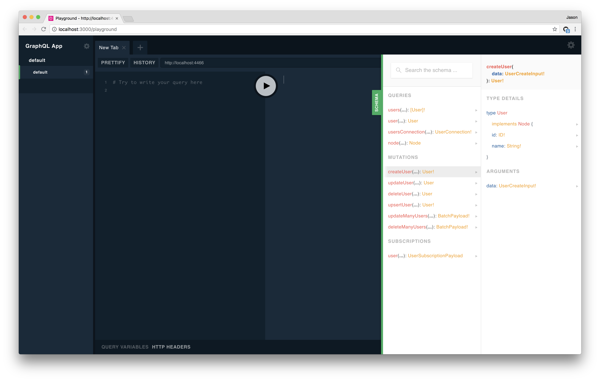
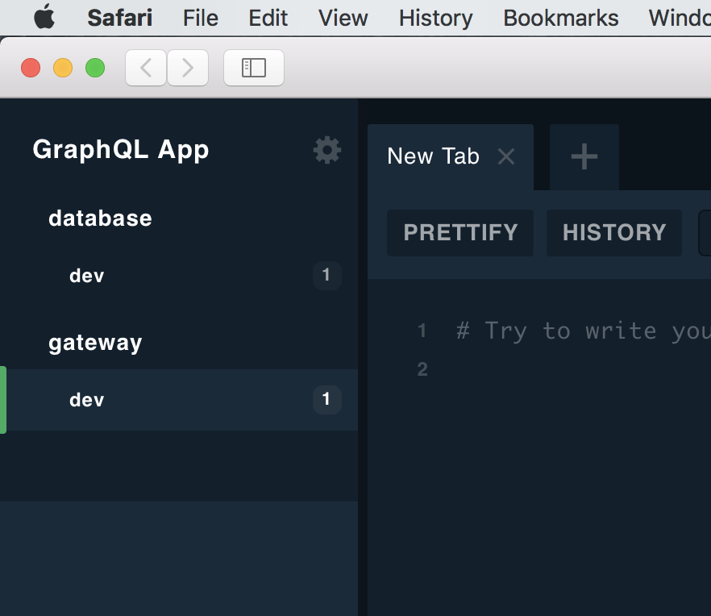

# Journaling The building of the Foobar Platform

I am interested in exploring an architecture based on GraphQL. I will record my attempt to do so verbatium, as best I reasonably can. My use-case will be building a vastly simpler form of the Dialogue platform where I work. This fact will drive my technical decisions. I am not thinking about a simple app/backend setup but a larger multiple cross-platform apps + micro service architecture with real time stream data chat etc.

- [Journaling The building of the Foobar Platform](#journaling-the-building-of-the-foobar-platform)
  - [Lay of the Land – June 7](#lay-of-the-land--june-7)
  - [Breaking Ground – June 11](#breaking-ground--june-11)
      - [Prisma Server Locally](#prisma-server-locally)
      - [Securing Prisma Server](#securing-prisma-server)
      - [Onward](#onward)
      - [Starting the Dialogue Schema](#starting-the-dialogue-schema)
  - [The Gateway – June 13](#the-gateway--june-13)
      - [GQL Playground With Multiple Apps](#gql-playground-with-multiple-apps)
      - [Building the Scheama](#building-the-scheama)
        - [User Sign Up](#user-sign-up)

## Lay of the Land – June 7

Some of the tools I have earmarked for my journey:

- [Prisma](https://www.prisma.io/)
  Prisma turns databases into APIs. We don't want to work with the database directly unless we need to. With Prisma we design our schema and it figures out how to translate that to tables or whatever the underlying data model of the db is. By using Prisma we are going to get all sorts of features in the form of a GraphQL service and so will uniformly integrate with our GraphQL architecture. We're also going to get reactive real-time features for free with Prisma. Prisma will handle migrations when we change our schema. But lets not hype too much yet. We shall soon see how things actually go in practice...

- [GraphQL Yoga](https://github.com/prismagraphql/graphql-yoga)
  We don't want to expose Prisma services directly to clients over the internet. Remember that the Prisma service is the database as an API. Its like giving direct SQL access to the user. Also another reason it does not make sense to use Prisma for the public facing API is that any non-trivial platform is going to be some flavour of microservices plus some legacy systems plus some third-party systems etc. We need a gateway to abstract this from the client. Prisma is not a gateway. Remember it just turns a single database into an API.

  So enter GraphQL Yoga. It is a batteries-included GraphQL server framework that we can use to build a bespoke GraphQL service, appropiate for meeting our need of a Gateway. It is built on top of [Apollo Server](https://github.com/apollographql/apollo-server), has excellent TypeScript support, and its development is led by the same people behind Prisma, therefore we can expect two things:

  1.  Reap the benefits and momentum of the Apollo community.
  2.  Tight technical interop/community/support/docs with Prisma.

  Seems good on paper. We'll see how it plays out later.

- [Apollo Engine](https://www.apollographql.com/engine)
  How are we going to monitor, cache, and generally operationally understand our running services? Throwing up an ELK stack and piping stdout logs from our services might get us some of the way but but it sounds like work with an unclear fit beyond the basics. It turns out the community has produced some purpose-built tools. Apollo Engine is a leading option. Its open-source and can be self-hosted or Apollo has service offerings. I will take the self-hosted route both because I'm cheap and because we want to see how easy a self-hosted architecture will be. Prisma claims to offer caching features as well so it will be interesting to see how the dynamic plays out between using Engine and Prisma. It may be that we will only place Engine in front of the Gateway or that we will disable Engine caching on the instance in front of Prisma. I'm also curious to see if multiple Engines will be discrete dashboards or if there will be a way to have a unified view of them all.

- [Kubernetes](https://aws.amazon.com/eks/)
  We will need to deploy to something. Now I've considered deploying to GraphQL to lambda but there are a few issues that that:

  1.  Prisma services need to be deployed to a long-lived Prisma Cluster, this rules out lambda
  2.  GraphQL subscriptions, because of their stateful nature, also require long-lived services, which again rules out lambda.

  I am very much interested in the real-time data subscriptions aspect so lambda appears off the table for me. Related talkes: [Sashko at GQL SF Meetup](https://www.youtube.com/watch?v=aNbxH9KQqiA).

  Kubernetes is something that I have experience with from multiple companies. I'm not sure it would be a good choice if I had never used Kubernetes (probably not!) but I am going to leverage my knowledge here and we'll see how things go. The nice about K8S is that we get a single system to manage different workloads. We can do serverless (with kubeless), long-lived services, cron, etc. and even stateful services like databases and queues (but that is definetely more advanced and doing it in a production-ready way is beyond my current ability). We will use kubernetes to deploy Engine, Prisma Cluster, and our Gateway.

  Lastly worth mentioning is we will be using the new generally available AWS hosted kubernetes service. I am not an ops person so managing my own k8s cluster is not something I'm willing to do. It would take too much focus off my primary goal. But hosted options are knwon to work well and while I'm more familiar with GKE from Google Cloud I assume AWS's new offering is going to work well. I am primarially using AWS because at Dialogue we are already on AWS.

- [Apollo](https://www.apollographql.com/docs/react/)?
  I will build the app in React beause I appreciate functional programming and because react is a simple production ready library with a huge community. But there are some library choices wih regards to how best to integrate GraphQL into React. Apollo is probably the one to use these days in terms of ease-of-use and community. However I am quite drawn to the modularity of relay, specifically its [Fragment Container](https://facebook.github.io/relay/docs/en/fragment-container.html) concept. I would need to build a prototype in both Relay and Apollo to figure out which is really better for me. Relay integrates very well with Flow but since I am going to be using TypeScript on the server and therefore ideally the client too it is a point toward Apllo which to my knowledge plays well with TypeScript.

- ~~AWS App Sync~~
  [Here is a nice technical demo/intro video for AppSync](https://www.youtube.com/watch?v=jZ2yd9xd-fI). This is a hosted-graphql option from AWS. I have played a big with it and concluded that for integration into a larger platform and leveraging the community tools it is not the ideal option. It seems great if I were built a green field project. But at Dialogue where the use-case I have in mind is, we have many databases, APIs etc. already. I could wire up lambda functions to AppSync resolvers to implement all the custom logic I want but it still doesn't equal what is possible with custom schema directives, schema stitching, and introspective the selection set for easy forwarding to second-layer graphql services. I may revisit AppSync later but presently I want to start with the flexibility and see later if I can achieve it with AppSync.

  -- edit: Note I learned about [serverless-appsync-plugin](https://github.com/sid88in/serverless-appsync-plugin) which would appear to make appsync a _lot_ more usable.

- Learning material

  There's lots, for example:

  - https://dev-blog.apollodata.com
  - https://aws.amazon.com/blogs/mobile
  - https://blog.graph.cool
  - https://medium.com/open-graphql
  - [Nate Barbettini – API Throwdown: RPC vs REST vs GraphQL, Iterate 2018](https://www.youtube.com/watch?v=IvsANO0qZEg)
  - [Apollo Youtub Channel](https://www.youtube.com/channel/UC0pEW_GOrMJ23l8QcrGdKSw)

That's it for now. Time for bed. I will expect to break ground on deploying a kubernetes and prisma cluster next time. Cheers!

## Breaking Ground – June 11

We will start with Prisma because it will be the core from which we build outward. We could go inward (client first) but my current interest is backend focused.

There are two ways to get going with Prisma:

- [using Prisma Cloud which is their hosted offering](https://www.prisma.io/cloud/)
- [self-hosted Prisma in docker](https://www.prisma.io/docs/reference/prisma-servers-and-dbs/prisma-servers/docker-aira9zama5)

For now we're going to stick to localhost so neither workflow interests us much yet, but local development is still based on docker as we will see.

If we were going to deploy right now Prisma Cloud has a free tier and it will allow us to get going quickly. Self-hosted would require us to have some deployment target, of which my preference would be kubernetes. All of that takes more up-front cost however.

On another note there are some important doc links we should mark:

- [Prisma docs](https://www.prisma.io/docs/), the entry point to it all.
- Also noticed they have a nice [reference index](https://www.prisma.io/docs/reference/). That's going to come in handy later I'm sure.
- Also noticed some nice looking information on the [Github CLI README](https://github.com/prismagraphql/prisma/tree/master/cli#is-prisma-an-orm).

#### Prisma Server Locally

Our first steps are going to be using the Prisma command line tool to get a project bootstrapped.

```
$ yarn global install prisma
```

```
yarn global v1.7.0
[1/4] 🔍  Resolving packages...
[2/4] 🚚  Fetching packages...
[3/4] 🔗  Linking dependencies...
warning "prisma > prisma-cli-core@1.0.46" has unmet peer dependency "graphql@^0.12.0 || ^0.13.0".
[4/4] 📃  Building fresh packages...
success Installed "prisma@1.9.0" with binaries:
      - prisma
✨  Done in 14.23s.
```

```
$ cd ~/projects/personal
$ prisma init foobar
```

Arrows indicate which option I choose:

```
? Set up a new Prisma server or deploy to an existing server? (Use arrow keys)

  Set up a new Prisma server for local development (based on docker-compose):
  Use existing database      Connect to existing database
❯ Create new database        Set up a local database using Docker

  Or deploy to an existing Prisma server:
  Demo server                Hosted demo environment incl. database (requires login)
  Use other server           Manually provide endpoint of a running Prisma server
```

What db? Note that Prisma has the goal of abstracting many more (ideally all) possible DBs. [Work on different DBs is tracked in GH issues with community input to provide priority](https://github.com/prismagraphql/prisma/issues?q=label%3Aarea%2Fconnector+label%3Akind%2Ffeature). A few of my personal favour dbs: [dgraph](https://github.com/prismagraphql/prisma/issues/1648), [dynamodb (because it is relied upon heavily at Dialogue)](https://github.com/prismagraphql/prisma/issues/1655).

```
❯ prisma init foobar
? Set up a new Prisma server or deploy to an existing server? Create new database
? What kind of database do you want to deploy to?
  MySQL             MySQL compliant databases like MySQL or MariaDB
❯ PostgreSQL        PostgreSQL database
```

Summary & next steps:

```
? Set up a new Prisma server or deploy to an existing server? Create new database
? What kind of database do you want to deploy to? PostgreSQL

Created 3 new files:

  prisma.yml           Prisma service definition
  datamodel.graphql    GraphQL SDL-based datamodel (foundation for database)
  docker-compose.yml   Docker configuration file

Next steps:

  1. Open folder: cd foobar
  2. Start your Prisma server: docker-compose up -d
  3. Deploy your Prisma service: prisma deploy
  4. Read more about Prisma server:
     http://bit.ly/prisma-server-overview
```

Lets take a look at the initial files:

```
$ cat datamodel.graphql
```

```
type User {
  id: ID! @unique
  name: String!
}
```

We have a very basic schema. The `@unique` is a custom [directive](http://facebook.github.io/graphql/October2016/#sec-Validation.Directives) particular to Prisma. It does not exist in [the base GraphQL spec](http://facebook.github.io/graphql/October2016/#sec-Type-System.Directives). In part its purpose is to help Prisma map the schema to the underlying database.

```
$ cat prisma.yml
endpoint: http://localhost:4466
datamodel: datamodel.graphql
```

Very basic initial configuration of the Prisma manifest. This manifest is used by the Prisma CLI to do the right thing when managing your project. For example `$ prisma deploy` will honour settings found in here. Precise documentation for this manifest are [here](https://www.prisma.io/docs/reference/service-configuration/prisma.yml/yaml-structure-ufeshusai8), but we don't need to know all of this just yet.

Some interesting information about `endpoint`.

- If not present `prisma deploy` kicks of the wizzard we just ran
- The URL provided has the following structure: `{host}/{service}/{stage}`
- `service` and `strage` default to `default`.
- If using Prisma Cloud there is a different structure: `{host}/{workplace}/{service}/{stage}`. I am not sure sure what the full significance of workplace is yet. I suspect its like an account namesapce however (since Prisma Cloud is not just for us).

Some interesting information about `datamodel`:

- points to one or more SDL ([Schema Definition Language](https://blog.graph.cool/graphql-sdl-schema-definition-language-6755bcb9ce51)) files.
- If supplying multiple files, those files are concatenated together by the CLI

Finally the docker compose file:

```
$ cat docker-compose.yml
```

```yaml
version: '3'
services:
  prisma:
    image: prismagraphql/prisma:1.9
    restart: always
    ports:
    - "4466:4466"
    environment:
      PRISMA_CONFIG: |
        port: 4466
        # uncomment the next line and provide the env var PRISMA_MANAGEMENT_API_SECRET=my-secret to activate cluster security
        # managementApiSecret: my-secret
        databases:
          default:
            connector: postgres
            host: postgres
            port: 5432
            user: prisma
            password: prisma
            migrations: true
  postgres:
    image: postgres
    restart: always
    environment:
      POSTGRES_USER: prisma
      POSTGRES_PASSWORD: prisma
    volumes:
      - postgres:/var/lib/postgresql/data
volumes:
  postgres:
```

The office Docker v3 docker-compose file documentation can be found [here](https://docs.docker.com/compose/compose-file/).

Two services are configured, a db, and prisma itself that will use said db. The prisma config is nested YAML but to avoid conflicts with the parent docker-compose yaml is turned into a yaml string literal. About ports/hosts:

- We configure prisma to launch on port 4466
- We configure docker compose to expose prisma service from inner port 4466 (must match what we configured in the prisma config) to the external host post 4466. It just happens to be the same.
- We configure prisma to connect to postgres at `postgres:5432`. The post must be a well known postgres default, the host comes from the fact we named our postgres service in docker-compose `postgres` (amazingly simple, docker-compose service keys turn into DNS entries effectively, I'm not sure about the details of this but that's how it feels as connecting client). Also notice that the postgres port `5432` was not exposed in docker-compose in the postgres service like it was for the prisma service. Why? Its because Prisma will be connecting to postgres within the internal network created by docker-compose which boths ervices live on. On the other hand if we want our app that is _not_ running in docker compose to connect to the Prisma service we need to expose some ports of said service on the host machine. This is my current understanding. I may be wrong or have factual errors in some deatils. I am not 100% I am exactly correct here but this is my current understanding.

I was not able to find a dedicated doc page for the config passed to Prisma but [I did find something within the docker page](https://www.prisma.io/docs/reference/prisma-servers-and-dbs/prisma-servers/docker-aira9zama5#configuration-with-docker-compose). If I find time [I can patch the docs myself to improve it](https://github.com/prismagraphql/prisma/tree/master/docs/1.9/04-Reference/05-Prisma-Servers-%26-DBs/01-Prisma-Servers).

Now that we have levelset lets press on.

```
$ docker-compose up --detach
```

```
docker-compose up --detach
Creating network "foobar_default" with the default driver
Creating volume "foobar_postgres" with default driver
Pulling prisma (prismagraphql/prisma:1.9)...
1.9: Pulling from prismagraphql/prisma
[...]
Status: Downloaded newer image for prismagraphql/prisma:1.9
Creating foobar_prisma_1   ... done
Creating foobar_postgres_1 ... done
```

Now we have launched our Prisma Server. Lets double check:

```
$ docker-compose ps
```

```
      Name                     Command              State           Ports
----------------------------------------------------------------------------------
foobar_postgres_1   docker-entrypoint.sh postgres   Up      5432/tcp
foobar_prisma_1     /bin/sh -c /app/start.sh        Up      0.0.0.0:4466->4466/tcp
```

This is _not_ our Prisma _Service_. Prisma Server is what we will deploy our Prisma Services _to_. Our Prisma Services are our schemas etc. Prisma Server does the magic of converting our service definition into a live running service.

```
$ prisma deploy
```

```
$ prisma deploy
Creating stage default for service default ✔
Deploying service `default` to stage `default` to server `local` 791ms

Changes:

  User (Type)
  + Created type `User`
  + Created field `id` of type `GraphQLID!`
  + Created field `name` of type `String!`
  + Created field `updatedAt` of type `DateTime!`
  + Created field `createdAt` of type `DateTime!`

Applying changes 1.1s

Your Prisma GraphQL database endpoint is live:

  HTTP:  http://localhost:4466
  WS:    ws://localhost:4466
```

Prisma deployed to localhost because that's what we have configured in our prisma manifest shown before.

#### Securing Prisma Server

You may have noticed this in the `PRISMA_CONFIG` before:

```
# uncomment the next line and provide the env var PRISMA_MANAGEMENT_API_SECRET=my-secret to activate cluster security
# managementApiSecret: my-secret
```

We did not set this. Consequently there is no access security on our Prisma Server. Anyone could run the Prisma CLI against our instance. While not technically a problem in local development lets keep this in mind.

The authentication docs are covered [here](https://www.prisma.io/docs/reference/prisma-servers-and-dbs/prisma-servers/overview-eu2ood0she/#authentication).

There is a legacy authentication system. It is asymmetric in that there is a public/private key pair. The server is given the public key while the CLI holds on to the private key and uses it to generate authentication tokens. Prisma Server will accept the public key passed in the docker run.

The new authentication is so-called "symmetric". There is a single secret, chosen by the Prisma server (passed as `managementApiSecret` in container), that must somehow be made accessible to the Prisma CLI as an environment variable `PRISMA_MANAGEMENT_API_SECRET`.

Example of auth failure:

```
$ prisma deploy
```

```
Creating stage default for service default !
 ▸    Server at http://localhost:4466 requires a
 ▸    cluster secret. Please provide it with the
 ▸    env var PRISMA_MANAGEMENT_API_SECRET
```

#### Onward

With our first Prisma Service deployed we can start to play with it:

```
$ prisma playground
```



Interruption: Just discovered a [new GraphQL book beta was released today](https://graphql.guide/). Neat. Also found out that a new version (polish) of the [GraphQL spec was published 23 hours ago](https://github.com/facebook/graphql/releases/tag/June2018).

When we deploy our Prisma Service to Prisma Server it takes care of augmenting our schema with an [OpenCRUD schema](https://www.opencrud.org) (that is Prisma's own open standard). You can explore the schema pane on Prisma Playground to see this. However we will also download a tool that shows us the schema in plain GraphQL SDL so that we can compare even more easily to what we could write as an SDL author. To do this we will install a graphql tool for working with graphql APIs. It will allow us to easily download the Prisma Service schema.

```
$ yarn global add graphql-cli
$ graphql init
```

```
? Enter project name (Enter to skip): foobar
? Local schema file path: schema.graphql
? Endpoint URL (Enter to skip): http://localhost:4466
? Name of this endpoint, for e.g. default, dev, prod: core
? Subscription URL (Enter to skip):
? Do you want to add other endpoints? No
? What format do you want to save your config in? YAML

About to write to /Users/jasonkuhrt/projects/personal/foobar/.graphqlconfig.yaml:

projects:
  foobar:
    schemaPath: schema.graphql
    extensions:
      endpoints:
        core: 'http://localhost:4466'

? Is this ok? Yes
```

From the base schema we started with:

```graphql
type User {
  id: ID! @unique
  name: String!
}
```

The following GraphQL Schema has been generated:

```
$ graphql get-schema --console
```

```graphql
type AggregateUser {
  count: Int!
}

type BatchPayload {
  """
  The number of nodes that have been affected by the Batch operation.
  """
  count: Long!
}

"""
The `Long` scalar type represents non-fractional signed whole numeric values.
Long can represent values between -(2^63) and 2^63 - 1.
"""
scalar Long

type Mutation {
  createUser(data: UserCreateInput!): User!
  updateUser(data: UserUpdateInput!, where: UserWhereUniqueInput!): User
  deleteUser(where: UserWhereUniqueInput!): User
  upsertUser(
    where: UserWhereUniqueInput!
    create: UserCreateInput!
    update: UserUpdateInput!
  ): User!
  updateManyUsers(data: UserUpdateInput!, where: UserWhereInput): BatchPayload!
  deleteManyUsers(where: UserWhereInput): BatchPayload!
}

enum MutationType {
  CREATED
  UPDATED
  DELETED
}

"""
An object with an ID
"""
interface Node {
  """
  The id of the object.
  """
  id: ID!
}

"""
Information about pagination in a connection.
"""
type PageInfo {
  """
  When paginating forwards, are there more items?
  """
  hasNextPage: Boolean!

  """
  When paginating backwards, are there more items?
  """
  hasPreviousPage: Boolean!

  """
  When paginating backwards, the cursor to continue.
  """
  startCursor: String

  """
  When paginating forwards, the cursor to continue.
  """
  endCursor: String
}

type Query {
  users(
    where: UserWhereInput
    orderBy: UserOrderByInput
    skip: Int
    after: String
    before: String
    first: Int
    last: Int
  ): [User]!
  user(where: UserWhereUniqueInput!): User
  usersConnection(
    where: UserWhereInput
    orderBy: UserOrderByInput
    skip: Int
    after: String
    before: String
    first: Int
    last: Int
  ): UserConnection!

  """
  Fetches an object given its ID
  """
  node(
    """
    The ID of an object
    """
    id: ID!
  ): Node
}

type Subscription {
  user(where: UserSubscriptionWhereInput): UserSubscriptionPayload
}

type User implements Node {
  id: ID!
  name: String!
}

"""
A connection to a list of items.
"""
type UserConnection {
  """
  Information to aid in pagination.
  """
  pageInfo: PageInfo!

  """
  A list of edges.
  """
  edges: [UserEdge]!
  aggregate: AggregateUser!
}

input UserCreateInput {
  name: String!
}

"""
An edge in a connection.
"""
type UserEdge {
  """
  The item at the end of the edge.
  """
  node: User!

  """
  A cursor for use in pagination.
  """
  cursor: String!
}

enum UserOrderByInput {
  id_ASC
  id_DESC
  name_ASC
  name_DESC
  updatedAt_ASC
  updatedAt_DESC
  createdAt_ASC
  createdAt_DESC
}

type UserPreviousValues {
  id: ID!
  name: String!
}

type UserSubscriptionPayload {
  mutation: MutationType!
  node: User
  updatedFields: [String!]
  previousValues: UserPreviousValues
}

input UserSubscriptionWhereInput {
  """
  Logical AND on all given filters.
  """
  AND: [UserSubscriptionWhereInput!]

  """
  Logical OR on all given filters.
  """
  OR: [UserSubscriptionWhereInput!]

  """
  Logical NOT on all given filters combined by AND.
  """
  NOT: [UserSubscriptionWhereInput!]

  """
  The subscription event gets dispatched when it's listed in mutation_in
  """
  mutation_in: [MutationType!]

  """
  The subscription event gets only dispatched when one of the updated fields names is included in this list
  """
  updatedFields_contains: String

  """
  The subscription event gets only dispatched when all of the field names included in this list have been updated
  """
  updatedFields_contains_every: [String!]

  """
  The subscription event gets only dispatched when some of the field names included in this list have been updated
  """
  updatedFields_contains_some: [String!]
  node: UserWhereInput
}

input UserUpdateInput {
  name: String
}

input UserWhereInput {
  """
  Logical AND on all given filters.
  """
  AND: [UserWhereInput!]

  """
  Logical OR on all given filters.
  """
  OR: [UserWhereInput!]

  """
  Logical NOT on all given filters combined by AND.
  """
  NOT: [UserWhereInput!]
  id: ID

  """
  All values that are not equal to given value.
  """
  id_not: ID

  """
  All values that are contained in given list.
  """
  id_in: [ID!]

  """
  All values that are not contained in given list.
  """
  id_not_in: [ID!]

  """
  All values less than the given value.
  """
  id_lt: ID

  """
  All values less than or equal the given value.
  """
  id_lte: ID

  """
  All values greater than the given value.
  """
  id_gt: ID

  """
  All values greater than or equal the given value.
  """
  id_gte: ID

  """
  All values containing the given string.
  """
  id_contains: ID

  """
  All values not containing the given string.
  """
  id_not_contains: ID

  """
  All values starting with the given string.
  """
  id_starts_with: ID

  """
  All values not starting with the given string.
  """
  id_not_starts_with: ID

  """
  All values ending with the given string.
  """
  id_ends_with: ID

  """
  All values not ending with the given string.
  """
  id_not_ends_with: ID
  name: String

  """
  All values that are not equal to given value.
  """
  name_not: String

  """
  All values that are contained in given list.
  """
  name_in: [String!]

  """
  All values that are not contained in given list.
  """
  name_not_in: [String!]

  """
  All values less than the given value.
  """
  name_lt: String

  """
  All values less than or equal the given value.
  """
  name_lte: String

  """
  All values greater than the given value.
  """
  name_gt: String

  """
  All values greater than or equal the given value.
  """
  name_gte: String

  """
  All values containing the given string.
  """
  name_contains: String

  """
  All values not containing the given string.
  """
  name_not_contains: String

  """
  All values starting with the given string.
  """
  name_starts_with: String

  """
  All values not starting with the given string.
  """
  name_not_starts_with: String

  """
  All values ending with the given string.
  """
  name_ends_with: String

  """
  All values not ending with the given string.
  """
  name_not_ends_with: String
}

input UserWhereUniqueInput {
  id: ID
}
```

Wow! We get pagination for free. We can all sorts of conditional selects and batch operations for free. We can live data for free. Etc. Very cool.

#### Starting the Dialogue Schema

Now that we've gotten some introductions out of the way lets begin building out our Foobar schema. Remember Foobar is a virtual clinic where patients can chat with practitioners.

```graphql
# General

type User {
  id: ID! @unique
  email: string!
  medical_episodes: [MedicalEpisode!]!
  chat_messages: [ChatMessage!]!
}

type MedicalEpisode {
  id: ID! @unique
  resolved: Bool!
  patient: User!
  # If null it means the patient is waiting to be seen
  practitioner: User
  created_at: Date!
  chat_messages: [ChatMessage!]!
}

# Messaging

union ChatMessage = TextMessage

interface ChatMessageBase {
  id: ID! @unique
  sent_at: Date!
  # If null it means the message has not been delivered to peers yet
  delivered_at: Date
  medical_episode: MedicalEpisode!
}

type TextMessage implements ChatMessageBase {
  content: string!
  author: User!
}
```

Now we have Users, chat messages that users can create, and chats that can contain both of those. The kind of chat we support is not general. Our concept of a chat is a medical episode that is initiated by a patient and responded to by a practitioner.

This schema truly is a minimal first draft. I am doubtful that our epiosde modelling will capture the full chat model we need ultimately; Chat messages are going to need to have a multi-media concept; Bots and system messages will need to be supported.

Before moving on lets deploy our updated Prisma service.

```
$ prisma deploy
```

```
Deploying service `default` to stage `default` to server `local` 134ms

Errors:

  User
    ✖ The field `email` has the type `string!` but there's no type or enum declaration with that name.
    ✖ The field `chat_messages` has the type `[ChatMessage!]!` but there's no type or enum declaration with that name.

  MedicalEpisode
    ✖ The field `resolved` has the type `Bool!` but there's no type or enum declaration with that name.
    ✖ The field `created_at` has the type `Date!` but there's no type or enum declaration with that name.
    ✖ The field `chat_messages` has the type `[ChatMessage!]!` but there's no type or enum declaration with that name.
    ✖ The relation field `patient` must specify a `@relation` directive: `@relation(name: "MyRelation")`
    ✖ The relation field `practitioner` must specify a `@relation` directive: `@relation(name: "MyRelation")`

  TextMessage
    ✖ The field `content` has the type `string!` but there's no type or enum declaration with that name.

Deployment canceled. Please fix the above errors to continue deploying.
Read more about deployment errors here: https://bit.ly/prisma-force-flag
```

Nice feedback, we made a bunch of mistakes. Some of these errors I'm not sure how to fix, like `Date` not being a known type. This is a good time to refer to the [Prisma data modelling docs](https://www.prisma.io/docs/reference/service-configuration/data-modelling-(sdl)-eiroozae8u).

* [I discovered that GQL interfaces are not currently supported](https://github.com/prismagraphql/prisma/issues/83). :(
* [I discovered that GQL unions are not currently supported](https://github.com/prismagraphql/prisma/issues/165)
* [I discovered that there is a an issue suggesting many more data model constraints](https://github.com/prismagraphql/prisma/issues/728)

Our revised schema looks like:

```graphql
type User {
  id: ID! @unique
  email: String! @unique
  medical_episodes: [MedicalEpisode!]! @relation(name: "MedicalEpisodes")
  chat_messages: [ChatMessage!]!
}

type MedicalEpisode {
  id: ID! @unique
  resolved: Boolean @default(value: "false")
  patient: User! @relation(name: "Patient")
  # If null it means the patient is waiting to be seen
  practitioner: User @relation(name: "Practitioner")
  created_at: DateTime!
  chat_messages: [ChatMessage!]!
}

type ChatMessage {
  # interface
  id: ID! @unique
  sent_at: DateTime!
  # If null it means the message has not been delivered to peers yet
  delivered_at: DateTime
  medical_episode: MedicalEpisode!
  # TextMessage
  content: String!
  owner: User!
}
```

And now the deploy works:

```
Deploying service `default` to stage `default` to server `local` 411ms

Changes:

  User (Type)
  - Deleted field `name`
  + Created field `email` of type `String!`
  + Created field `medical_episodes` of type `[Relation!]!`
  + Created field `chat_messages` of type `[Relation!]!`

  MedicalEpisode (Type)
  + Created type `MedicalEpisode`
  + Created field `id` of type `GraphQLID!`
  + Created field `resolved` of type `Boolean`
  + Created field `patient` of type `Relation!`
  + Created field `practitioner` of type `Relation`
  + Created field `created_at` of type `DateTime!`
  + Created field `chat_messages` of type `[Relation!]!`
  + Created field `updatedAt` of type `DateTime!`
  + Created field `createdAt` of type `DateTime!`

  ChatMessage (Type)
  + Created type `ChatMessage`
  + Created field `id` of type `GraphQLID!`
  + Created field `sent_at` of type `DateTime!`
  + Created field `delivered_at` of type `DateTime`
  + Created field `medical_episode` of type `Relation!`
  + Created field `content` of type `String!`
  + Created field `owner` of type `Relation!`
  + Created field `updatedAt` of type `DateTime!`
  + Created field `createdAt` of type `DateTime!`

  ChatMessageToUser (Relation)
  + Created relation between ChatMessage and User

  Practitioner (Relation)
  + Created relation between MedicalEpisode and User

  ChatMessageToMedicalEpisode (Relation)
  + Created relation between ChatMessage and MedicalEpisode

  Patient (Relation)
  + Created relation between MedicalEpisode and User

  MedicalEpisodes (Relation)
  + Created relation between MedicalEpisode and User

Applying changes 1.1s

Your Prisma GraphQL database endpoint is live:

  HTTP:  http://localhost:4466
  WS:    ws://localhost:4466
```

A quick test drive:

Create a subscription for any new users created:

```graphql
subscription users {
  user(where: { mutation_in: [CREATED] }) {
    node {
      id
      email
    }
  }
}
```

In a new tab, create some new users. Here's a mutation I used (supply the email variable in the variables tab at the bottom):

```graphql
mutation create_user ($email: String!) {
  createUser(data: { email: $email}) {
    id
  }
}
```

You should see data coming through on your subscription: 

```json

{
  "data": {
    "user": {
      "node": {
        "id": "cjiceqbhl000a0739178vwy8n",
        "email": "foo@bar.qux"
      }
    }
  }
}

{
  "data": {
    "user": {
      "node": {
        "id": "cjiceqq2r000d073977y10odp",
        "email": "bar@qux.foo"
      }
    }
  }
}
```

Lets try pagination:

```graphql
query users {
  usersConnection {
    pageInfo {
      hasPreviousPage
      hasNextPage
      endCursor
      startCursor
    }
    edges {
      node {
        id
        email
      }
    }
    aggregate {
      count
    }
  }
}
```
```json
{
  "data": {
    "usersConnection": {
      "pageInfo": {
        "hasPreviousPage": false,
        "hasNextPage": false,
        "endCursor": "cjiceqq2r000d073977y10odp",
        "startCursor": "cjice6h3300040739eeqq971m"
      },
      "edges": [
        {
          "node": {
            "id": "cjice6h3300040739eeqq971m",
            "email": "jasonkuhrt@me.com"
          }
        },
        {
          "node": {
            "id": "cjiceqbhl000a0739178vwy8n",
            "email": "foo@bar.qux"
          }
        },
        {
          "node": {
            "id": "cjiceqq2r000d073977y10odp",
            "email": "bar@qux.foo"
          }
        }
      ],
      "aggregate": {
        "count": 3
      }
    }
  }
}
```

Lets see how far we can get before this schema starts to feel uncomfortable. Next up we will create a Gateway that our subsequent apps can use.

## The Gateway – June 13 

Lets create a GraphQL gateway that will be consumed by client apps. 

We can remain in the `foobar` project folder and just tuck away the files we've accumulated so far into a folder called `/prisma`. 

```
$ mkdir prisma
$ mv {datamodel.graphql,docker-compose.yml,prisma.yml} prisma
```
We will create a new node server using `graphql-yoga`.

```
$ yarn init -y
$ yarn add graphql-yoga
```


> .  
> **Aside**  
> Just discovered a [nice aggregation of GraphQL tech](https://www.graphqlstack.com/) which therein included led me to discover [FastQL](https://fastql.io/). Nice.  
> .

Lets start off with a server that is more or less taken right out of the docs:

```
$ cat source/Main.ts
```

```
import { GraphQLServer } from "graphql-yoga"

const typeDefs = `
  type Query {
    hello(name:string): String!
  }
`

const resolvers = {
  Query: {
    hello: () => {
      return ""
    },
  },
}

const server = new GraphQLServer({ typeDefs, resolvers })

server.start().then(server => {
  console.log("started server at %s", server.address())
})
```

One of the things I don't like right off the bat is that:

* Our schema is a raw string in the codebase. At a minimum this prevents us from good syntax highlighting, but not just that...
* We don't get prettier auto-formatting
* Our resolver to `hello` is not typed. This is bad. Its type is a function of our schema. To type it we need to somehow convert our schema into TypeScript. It turns out that there is already a tool for that! [`graphql-code-generator`](https://github.com/dotansimha/graphql-code-generator#readme) (and [`graphql-codegen-typescript-template`](https://github.com/dotansimha/graphql-code-generator/tree/master/packages/templates/typescript) which plugs support for TypeScript). ~To leverage this tool it seems that we need to extract our schema into an external schema file.~ Turns out I was wrong, see below.

So for these two reasons alone it seems to me that we want to create a `schema.graphql` file in our project. But then how will we pass it to the `GraphQLServer` function in our code? There's a tool for that too: [`graphql-import`](https://github.com/prismagraphql/graphql-import).

Lets try all this.

> .
> **Aside**
> Got interrupted by this [nonsense](https://github.com/prismagraphql/graphql-yoga/issues/368) 
> Work around for now was to put `"skipLibCheck": true,` into my tsconfig.
> .

> .
> **Aside**
> Using [`ts-node-dev`](https://github.com/whitecolor/ts-node-dev) to re-start server on file change 
> .

We craete a script:

```json
"build:schema-ts": "gql-gen --schema http://localhost:4000 --template typescript --out ./source/SchemaTypes.ts"
```

What this does is:

* Download our server schema from a GQL endpoint (`--schema ...`)
* Create TypeScript types (`--template ...`)
* Outputs the TypeScript file to our source dir using given name `--out ...`

When we run it:

```
$ yarn -s build:schema-ts
23:46:58.831 - info: Loading GraphQL Introspection from remote: http://localhost:4000...
23:46:59.571 - info: Generated file written to /Users/jasonkuhrt/projects/personal/foobar/source/SchemaTypes.ts
```

And we get the following contents:

```
$ cat source/Schema.ts
```
```graphql
/* tslint:disable */

export interface Query {
  hello: string
}
export interface HelloQueryArgs {
  name?: string | null
}
```

Now we can update our server like so:

```graphql
import * as GQLImport from "graphql-import"
import * as Yoga from "graphql-yoga"
import * as S from "./SchemaTypes"

const typeDefs = GQLImport.importSchema(__dirname + "/schema.graphql")

const resolvers = {
  Query: {
    hello: (_: any, args: S.HelloQueryArgs) => {
      if (args.name) {
        return args.name.length
      } else {
        return "someone..."
      }
    },
  },
}

const server = new Yoga.GraphQLServer({ typeDefs, resolvers })

server.start().then(server => {
  console.log("started server at %s", JSON.stringify(server.address()))
})
```

Yay! I still don't know enough about the first `obj` argument to resolvers to tackle them. [They are briefly mentioned in the Apollo Server docs](https://www.apollographql.com/docs/graphql-tools/resolvers#Resolver-function-signature) but I need to actually play with them to fully understand. There is an [issue on GraphQL Tools repo about statically typing resolvers](https://github.com/apollographql/graphql-tools/issues/404).

So it turns out the only reasons for extracting the schema to its own `.graphql` file is for syntax highlighting and prettier autoformatting, so far...I thnink the endgame for external files anyways is to have modular schema/resolver groupings [like this example](https://github.com/prismagraphql/graphql-yoga/tree/master/examples/modular-resolvers#implementation). This point also brings up another reason why it makes sense that `gql-gen` does not rely on a file being passed but rather the server introspection: It doesn't matter how one structures their server, introspection will always yield a perfect resolved schema without any configuration fuss on how to do that. 👍

> .
> **Aside**
> I should probably create a minimal blog post about typing graphql server resolvers as there is no dead-simpel 1-2-3 on this published that I know of yet.
> .

I pushed the code so far to https://github.com/jasonkuhrt/fooql.

#### GQL Playground With Multiple Apps

I just fixed my `.graphqlconfig.yaml` so that when I boot up `graphql playground` it has both the prisma service and the gateway available to play with. This is great because I can have a great feedback loop when I have qustions of my services/data to ask. I'm also able to target a stage of those services. So while right now its just dev I could conceivably have production or some other staging there as well. So basically given a graphqlconfig file graphql cli knows how to serve up a client-side app (the playground) and have it connected to the given apps defined in said graphqlconfig. And of course this playground could be something deployed in the cloud for use by the team and what not.



> Minor detail, I'm hitting [this issue](https://github.com/graphql-cli/graphql-cli/issues/302) where a warning pops up when I start a playground.

#### Building the Scheama

Looking back at the databse schema I see that there are a few things we want to expose in the gateway. Lets design the schema now. One thing that will become apparent is how the gateway allows us to speak in terms of our domain while prisma services are low-level CRUD oriented. 

##### User Sign Up

First up lets make it possible for users to sign up.

> Noticed that we did not restart the server as we worked on the graphql file. Not acceptable. Solution was `nodemon --exec ts-node source/Main.ts --ext graphql,ts`

One thing we'll notice right away is the duplication of types:

```graphql
type Query {
  hello(name: String): String
}

input SignupInput {
  email: String!
}

type Mutation {
  signup(input: SignupInput!): User!
```

We have redefined `email` and would have to redefine `User`. But we already have this schema data at our db level! Lets find out how to leverage it. Reading:

* https://www.prisma.io/blog/graphql-schema-stitching-explained-schema-delegation-4c6caf468405/
* https://blog.graph.cool/how-do-graphql-remote-schemas-work-7118237c89d7
* https://www.apollographql.com/docs/graphql-tools/schema-stitching.html
* https://medium.com/open-graphql/graphql-schema-stitching-in-action-with-apollo-eba04f250588