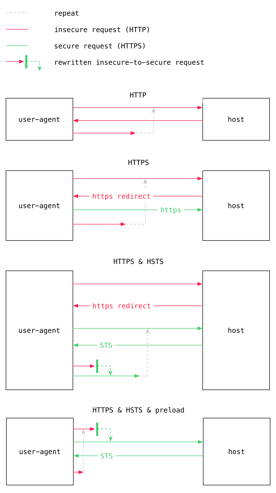

:toc: macro
:toc-title:
:sectanchors:
:toclevels: 99

# HTTP Strict Transfer Security

2017 September 26

toc::[]

Over the past few days I've come to know about and apply a technology at work called HTTP Strict Transfer Security (HSTS). This is an extension to the HTTP protocol that increases security for users by preventing user-agents from making insecure requests to the host. It manifests itself as a single response header called `Strict-Transfer-Security` (STS) of the following format:

```
Strict-Transfer-Security: max-age=<seconds>[; includeSubDomains][; preload]
```

Examples:

```
Strict-Transfer-Security: max-age=3600
```
```
Strict-Transfer-Security: max-age=3600; includeSubDomains
```
```
Strict-Transfer-Security: max-age=3600; includeSubDomains; preload
```

In short the above parameters tell the user-agent the following:

. `max-age` How long in seconds to consider this an HSTS host. If set to `0` then no longer consider this an HSTS host.
. `includeSubDomains` The HSTS policy applies to all sub domains of the host too
. `preload` The host should be added to the preload list (will be discussed in detail later)

As a side note I must admit that I find it rather sad, in my own obsessive compulsive way, that here we have a case of `;` delimited params unlike say `Cache-Control` which uses `,`, and that even within this single header schizophrenia insists itself between the kebob and camel case. I can only imagine that had `preload` been expressed in two words snake case would have further crashed the party. These are the paper cuts in an engineer's life.

## Motivation

So what _exactly_ does HSTS achieve? What problem is it trying to solve? The problem is that an HTTPS host can only at best guarantee that all responses will be served over HTTPS (rejecting or redirecting all requests over HTTP). It has no way of making a similar guarantee from the user-agent side. That is because it is always possible that a bug in application code, behaviour of some third party script, external link, manually typed URL like `foo.com` (browsers default to HTTP) and so on could lead to an insecure HTTP request, in turn making it possible for an attacker to see sensitive session data such as tokens in headers or identifying user data in cookies (that were not set with https://tools.ietf.org/html/rfc6265#section-5.2.5[`secure`]).

## Enter HSTS

But there is hope. If a host responds with an STS header then the user-agent will honour this by making the same guarantees that the host can about ensuring HTTPS-only communication. All insecure HTTP requests will be rewritten into secure HTTPS ones before taking flight. This sounds already a lot better, but unfortunately there remains a loophole as you may have noticed:

> [...] a host **responds** with an STS header [...]

We still don't have a guarantee that the user-agent will be making its first request over HTTPS. While to the layman (like myself, being _not_ a security expert) this attack vector may seem small, and the sensitive info possibly accumulated before first request minute, it is still real. But again there is hope, and it was previously mentioned: `preload`.

## Enter HSTS Preload

`preload` is a sort of informal extension to the HSTS specification (Not a formal one like https://tools.ietf.org/html/rfc7641[Observing Resources in the Constrained Application Protocol (CoAP)]) that the major browser vendors have consolidated around. Its presence in the header tells the user-agent that the host wants to be eligible to be on the user-agent's so-called preload list, and not just this instance of the user-agent, but rather to be literally hardcoded in the user-agent's software. So indeed every Chrome, FireFox, etc. release going out likely has a continually changing preload list deep in its 1's and 0's. https://src.chromium.org/viewvc/chrome/trunk/src/net/http/transport_security_state_static.json[See for yourself].

The preload list itself is just a set of HSTS domains, but by being preloaded into the user-agent's software, it means the user can now be guaranteed that _only_ HTTPS requests will ever be made to the host. Finally, an what-appears-to-be attack-vector-free experience for the user! Of course this is only true so long as the user-agent supports HSTS and preload lists... all major browser vendors do so unless your stuck in a time warp with IE6 users they should enjoy the stated guarantee.

Given that preload lists live hardcoded in software, it means host inclusion will not happen immediately, and once in, it will not be trivial to get out (there is a formal mechanism but the process is known to take months). It is also not possible to use `preload` without `includeSubDomains` so you need to be doubly sure that you can commit to supporting HTTPS when going down this route. Helpfully tools like https://letsencrypt.org are lowering the barrier while revelations like those of https://en.wikipedia.org/wiki/Citizenfour[Edward Snowden] are increasing the motivation. Secure communication is becoming the new default and HSTS is a fantastic feature for helping our users live more securely!

## Diagram

In the following diagram we go from totally insecure to totally secure.



## References

* https://tools.ietf.org/html/rfc6797 The HSTS spec
* https://hstspreload.org for checking host status and eligibility for preload
* https://scotthelme.co.uk/hsts-the-missing-link-in-tls/[Good article about HSTS] by Scott Helme
* https://scotthelme.co.uk/hsts-preloading[Follow up article specific to preload] by Scott Helme
