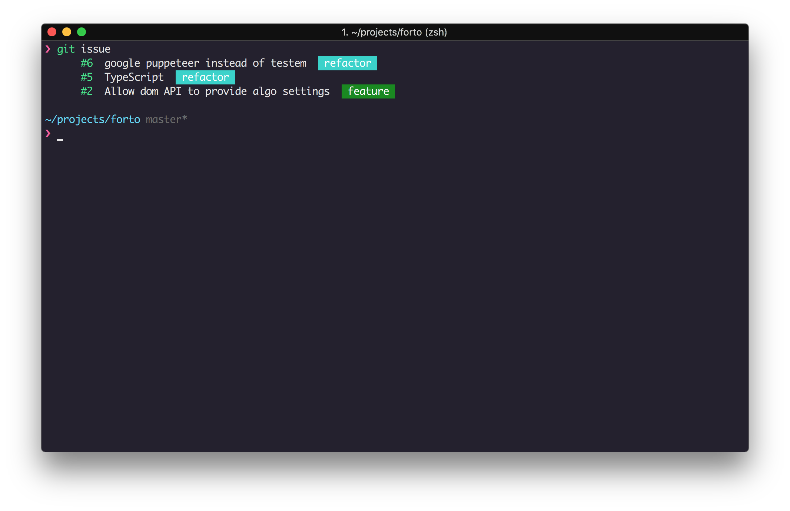
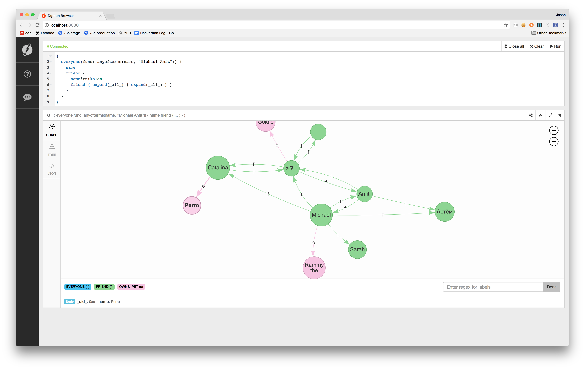

# Today I Learned

##### About

Also known as TIL, this stream records some of my personal learnings at a granular level. This acts a way to improve retention, share what I have been doing, motivate or help maintain my learning momentum, act as a track record of discipline (or lack thereof), and in the large contribute to a backlog of data that may help me better know thyself in the future.

At the risk of stating the obvious this format is nothing new. Surely most thinkers (great or otherwise) from ancient to modern times have maintained some sort of log, journal, notebook, or whatever. In my contemporary setting I have had direct influence from others practicing this kind of TIL e.g. [jbranchaud](https://github.com/jbranchaud/til/commits/master), [thoughtbot](https://github.com/thoughtbot/til), [milooy](https://github.com/milooy/TIL).

##

## 2018 Thu Jun 7

##### Journaling GraphQL Journey Part 1 

I am interested in exploring an architecture based on GraphQL. I will record my attempt to do so verbatium, as best I reasonably can. My use-case will be building a vastly simpler form of the Dialogue platform where I work. This fact will drive my technical decisions. I am not thinking about a simple app/backend setup but a larger multiple cross-platform apps + micro service architecture with real time stream data chat etc.

Some of the tools I have earmarked for my journey:

* [Prisma](https://www.prisma.io/)   
  Prisma turns databases into APIs. We don't want to work with the database directly unless we need to. With Prisma we design our schema and it figures out how to translate that to tables or whatever the underlying data model of the db is. By using Prisma we are going to get all sorts of features in the form of a GraphQL service and so will uniformly integrate with our GraphQL architecture. We're also going to get reactive real-time features for free with Prisma. Prisma will handle migrations when we change our schema. But lets not hype too much yet. We shall soon see how things actually go in practice...

* [GraphQL Yoga](https://github.com/prismagraphql/graphql-yoga)  
  We don't want to expose Prisma services directly to clients over the internet. Remember that the Prisma service is the database as an API. Its like giving direct SQL access to the user. Also another reason it does not make sense to use Prisma for the public facing API is that any non-trivial platform is going to be some flavour of microservices plus some legacy systems plus some third-party systems etc. We need a gateway to abstract this from the client. Prisma is not a gateway. Remember it just turns a single database into an API.

  So enter GraphQL Yoga. It is a batteries-included GraphQL server framework that we can use to build a bespoke GraphQL service, appropiate for meeting our need of a Gateway. It is built on top of [Apollo Server](https://github.com/apollographql/apollo-server), has excellent TypeScript support, and its development is led by the same people behind Prisma, therefore we can expect two things:

  1. Reap the benefits and momentum of the Apollo community.
  2. Tight technical interop/community/support/docs with Prisma.

  Seems good on paper. We'll see how it plays out later.

* [Apollo Engine](https://www.apollographql.com/engine)  
  How are we going to monitor, cache, and generally operationally understand our running services? Throwing up an ELK stack and piping stdout logs from our services might get us some of the way but but it sounds like work with an unclear fit beyond the basics. It turns out the community has produced some purpose-built tools. Apollo Engine is a leading option. Its open-source and can be self-hosted or Apollo has service offerings. I will take the self-hosted route both because I'm cheap and because we want to see how easy a self-hosted architecture will be. Prisma claims to offer caching features as well so it will be interesting to see how the dynamic plays out between using Engine and Prisma. It may be that we will only place Engine in front of the Gateway or that we will disable Engine caching on the instance in front of Prisma. I'm also curious to see if multiple Engines will be discrete dashboards or if there will be a way to have a unified view of them all.

* [Kubernetes](https://aws.amazon.com/eks/)  
  We will need to deploy to something. Now I've considered deploying to GraphQL to lambda but there are a few issues that that: 

  1. Prisma services need to be deployed to a long-lived Prisma Cluster, this rules out lambda 
  2. GraphQL subscriptions, because of their stateful nature, also require long-lived services, which again rules out lambda.

  I am very much interested in the real-time data subscriptions aspect so lambda appears off the table for me. Related talkes: [Sashko at GQL SF Meetup](https://www.youtube.com/watch?v=aNbxH9KQqiA).

  Kubernetes is something that I have experience with from multiple companies. I'm not sure it would be a good choice if I had never used Kubernetes (probably not!) but I am going to leverage my knowledge here and we'll see how things go. The nice about K8S is that we get a single system to manage different workloads. We can do serverless (with kubeless), long-lived services, cron, etc. and even stateful services like databases and queues (but that is definetely more advanced and doing it in a production-ready way is beyond my current ability). We will use kubernetes to deploy Engine, Prisma Cluster, and our Gateway.

  Lastly worth mentioning is we will be using the new generally available AWS hosted kubernetes service. I am not an ops person so managing my own k8s cluster is not something I'm willing to do. It would take too much focus off my primary goal. But hosted options are knwon to work well and while I'm more familiar with GKE from Google Cloud I assume AWS's new offering is going to work well. I am primarially using AWS because at Dialogue we are already on AWS.

* [Apollo](https://www.apollographql.com/docs/react/)?  
  I will build the app in React beause I appreciate functional programming and because react is a simple production ready library with a huge community. But there are some library choices wih regards to how best to integrate GraphQL into React. Apollo is probably the one to use these days in terms of ease-of-use and community. However I am quite drawn to the modularity of relay, specifically its [Fragment Container](https://facebook.github.io/relay/docs/en/fragment-container.html) concept. I would need to build a prototype in both Relay and Apollo to figure out which is really better for me. Relay integrates very well with Flow but since I am going to be using TypeScript on the server and therefore ideally the client too it is a point toward Apllo which to my knowledge plays well with TypeScript.

* ~~AWS App Sync~~  
  [Here is a nice technical demo/intro video for AppSync](https://www.youtube.com/watch?v=jZ2yd9xd-fI). This is a hosted-graphql option from AWS. I have played a big with it and concluded that for integration into a larger platform and leveraging the community tools it is not the ideal option. It seems great if I were built a green field project. But at Dialogue where the use-case I have in mind is, we have many databases, APIs etc. already. I could wire up lambda functions to AppSync resolvers to implement all the custom logic I want but it still doesn't equal what is possible with custom schema directives, schema stitching, and introspective the selection set for easy forwarding to second-layer graphql services. I may revisit AppSync later but presently I want to start with the flexibility and see later if I can achieve it with AppSync.

* Learning material  

  There's lots, for example:

  * https://dev-blog.apollodata.com
  * https://aws.amazon.com/blogs/mobile
  * https://blog.graph.cool
  * https://medium.com/open-graphql
  * [Nate Barbettini – API Throwdown: RPC vs REST vs GraphQL, Iterate 2018](https://www.youtube.com/watch?v=IvsANO0qZEg)
  * [Apollo Youtub Channel](https://www.youtube.com/channel/UC0pEW_GOrMJ23l8QcrGdKSw)

That's it for now. Time for bed. I will expect to break ground on deploying a kubernetes and prisma cluster next time. Cheers!

## 2018 Sat May 26

* Python PEP in 2006 for defining the concept of function annotations, just syntax, no inherent semantics
* Python PEP in 2014 for defining a type system living syntactically within these annotations
* Inspired by work down in MyPy

* [graphql-yoga](https://github.com/prismagraphql/graphql-yoga) is like create-react-app for building a graphql server.
* This [Prisma blog post about 2.0 bindings](https://www.prisma.io/blog/graphql-binding-2-0-improved-api-schema-transforms-automatic-codegen-5934cd039db1/) shows some examples of a GQL Gateway calling into GQL microservices. The deeper aka. lower level service exposed a CRUD api however the gateway exposed a DSL. For example the microservice has `create_post` and `update_post` but the gateway has `create_draft` and `publish`. This design pattern may be relevant in some future.

## 2018 Tue May 22

##### Better `git` config

* Use a global git ignore to ignore files that should always be ignored as well as files that are particular to you. For example `.vscode` is a folder that stores workspace settings. Not everyone on the team may be using `.vscode` and hence its not really the right place, ideally, to ignore it.
* Git docs about where global ignore file can be stored. The one I prefer is using `~/.config/git/ignore`: [link](https://git-scm.com/docs/gitignore/1.7.12).
* A gist containing what Github says is a good base for global ignore: [link](https://gist.github.com/octocat/9257657).

##### Serverless

TODO

## 2018 Sun May 20

##### AWS Step Functions

* AWS step functions can be implemented with an aws lambda
* The terminology is state machines with states and each state can be an AWS Lambda
* State names are scoped to region, not to the state machine they show up in... wtf ([ref](https://docs.aws.amazon.com/step-functions/latest/dg/amazon-states-language-states.html))
  > State machine names must be 1–80 characters in length, must be unique for your account and region, and must not contain any of the following: [...]
* There are several types of states: `Task` (bread and butter, run some logic), `Pass` (for noops), `Choice` (for branching based on task result), `Parallel` (for running multiple whole state machines at the same time, blocking for completion of all, aggregating results), `Failure` which simply ends the state machine with a bit of optional extra error metadata, `Success` which simply ends the state machine happily. ([ref](httphttps://docs.aws.amazon.com/step-functions/latest/dg/amazon-states-language-states.html))
* There is the concept of paths. The purpose of paths is to control the data flowing through the state machine and navigating how to react to its structure. There are three types of paths: `InputPath`, `OutputPath`,`ResultPath`. IP is concerned with a selector that filters the data sent to the state task, output path is concerned with filtering what the state passes to the next state, result path is concerned with where the task result will fit into the given input. ([ref](https://docs.aws.amazon.com/step-functions/latest/dg/amazon-states-language-input-output-processing.html)) The flow of path filtering is:
  ```
  state previous -> input -> state now -> IP -> task -> RP -> OP -> output -> state next
  ```
* paths are expressed as JSON Path
* IP can use `$` to pass all input, `null` to pass none (`Task` will get `{}` as input)
* RP can use `$` to pass just it to output (discard input), `null` to discard `Task` result, only support a subset of JSON Path b/c they are so-called `reference paths` which must identify a single node in a json structure.
* OP must match something in IP/RP or else an exception is raised
* OP can use `null` to pass `{}` as input to next state
* If a state does not execute a task its input is its output
* Still need to read about errors ([ref](https://docs.aws.amazon.com/step-functions/latest/dg/amazon-states-language-errors.html))

## 2018 Sun May 13

* Another Python tool came to my attention: https://pyre-check.org. Released a few days ago [by Facebook](https://www.facebook.com/notes/protect-the-graph/pyre-fast-type-checking-for-python/2048520695388071/).
* [Its easy to test local functions out with serverless](https://serverless.com/framework/docs/providers/aws/cli-reference/invoke-local/), for example the following was simply run in the root of a lambda project:

  ```bash
  ❯ sls invoke local --function on_message_2 --stage dev --data '{"a": 1}'
  {"timestamp": "2018-05-13 23:44:42,744", "level": "DEBUG", "location": "countdown.on_message.on_message:14", "message": {"event": {"a": 1}}, "request_id": "1234567890"}

  {
      "statusCode": 200,
      "body": "{}"
  }
  ```

* To log JSON out of a lambda just make sure that whatever you output to `stdout` is compliant JSON. Example in Python (note the values must of course be JSON serializable):

  ```py
  log.debug(json.dumps({'event': event}))
  ```

* AWS Lambda HTTP handler simply returns JSON like the following to respond:

```py
return {
  'statusCode': 200,
  'body': '{}'
}
```

## 2018 Tue May 6

I made a pull-Request applying some new personal knowledge about Python tooling. I exposed myself to some Python videos reccommended to me by a coleague.

##### Automatically Formatted Python Code

* Using `yapf` but also discovered `black`.
* `black` is new, gaining traction quickly (month or two, 1k+ Github Stars)
* `black` is simple, no configuration, always produces the same result regardless of input (compare to `yapf` which depending on the given format may produce different results. For example no empty new line after heredoc is honoured but multiple new lines after heredoc reformat into a single empty new line; said again, no newline is not reformatted to a single new line but multiple new lines are reformatted to a single new line)
* `black` is appealing to me on many levels but it doesn't make possible to aggressively pursue argument-per-line like `yapf` does with trailing comma. This is important to me. `black` also states it is far from production ready right now (aka. bugs)
* I put together a pull-request using `isort` and `yapf`. `yapf` team has said they will not deal with import formatting because it is too complicated.
* These two tools are listed as project deps.
* When using `pyls` I will just need to install it into the environment of the project (assuming virtualenv is being used). Atom will pick this since afterall its the bin on PATH.
* `pyls` is my editor-time integration. However not everyone on the team is or will necessarially use `pyls`. To streamline the workflow between team members a git hook is used to autoformat before committing.
* To streamline the hook across the team I used a tool called [`pre-commit`](https://pre-commit.com/). It acts like a package manager for git hooks. There happens to already be a `yapf` and `isort` `pre-commit` package. The manifest looks like:

```yaml
# The bash-based entry points work around the fact that pre-commit framework
# does not support inline/automatic modification of files on hook. Refer to
# https://github.com/pre-commit/pre-commit/issues/747
repos:
  - repo: https://github.com/pre-commit/mirrors-yapf
    rev: v0.21.0
    hooks:
      - id: yapf
        entry: bash -c 'yapf "$@"; git add -u' --
  - repo: https://github.com/pre-commit/mirrors-isort
    sha: 'v4.3.4'
    hooks:
      - id: isort
        entry: bash -c 'isort "$@"; git add -u' --
```

* Note the comment. Normally specifying the `entry` is not needed however because its important to me that autoformat silently and magically do its job without bothering the engineer and because any modified files on a hook cause `pre-commit` to fail this workaround was needed.
* In bash `$@` means all the arguments that were passed to the script.
* In `git add` `-u` stands for `--update` and it means and files that are in the stage that have changes in the working dir, stage again (this definition is not quite what I read online but its the only one that makes sense to me upon seeing its behaviour).

##### Python Videos

* Watched two python presentations
* http://pyvideo.org/pycon-ca-2012/a-python-sthetic-beauty-and-why-i-python.html
  * notes that code is improved if methods can be turned into functions that is logic that can model something other than a behaviour (uh, fp)
  * notes that math is the guide to Python compared to a few other languages (uh, fp)
  * notes that python has an internal consistent that will make sensitive people happy (so Haskell would make these people weep tears of joy?); exact quote:
    > my point is that Python has a logical inner consistency. And if you happen to be math-ish and sensitive, the consistency will make you happy.
  * notes that pipelines suffer from the problem that ``
  * notes that good python should let the caller decide to qualify or not. This is what Go enforces at the language level. I like this. A lot. Haskell hasn't quite caught up in general to it, it seems.
  * complains that one cannot symmetrically express binary operations (`a.foo(b) vs b.foo(a)`). But it seems to me Haskell works just fine here. It can express pipelines (meaning composed functions) that use currying to achieve either side `(+ a) b vs (+ b) a`.
  * seems to love Donald Knuth.
  * a lot of talk about code formatting, deviating from PEP8, etc. Seems like a big waste of time. Invest into an autoformatter and stop the bikeshedding.
* http://pyvideo.org/pycon-us-2015/beyond-pep-8-best-practices-for-beautiful-inte.html
  * seems like a seasoned engineer
  * a lot of talk about PEP8 and formatting again just invest into an auto formatter
  * really interesting point about weaker engineers gravitating to lesser problems like style improvement PRs.
  * really great point that one will bias to the problems they feel comfortable solving; when in an environment they aren't comfortable in, will start solving meta/chore issues
  * one big idea briefly mentioned is wrap non-pythonic APIs into Pythonic ones
  * he uses classes that implement interfaces by simply having the `__foo__` functions defined for it
  * An iterable just needs `__len__` and `__getitem__`

## 2018 Tue May 1

Continued learnings into Python, AWS, Serverless.

##### Python tooling

* PEP is an acronym for Python Enhancement Proposal
* PEP8 is a style guide for python code dating back to 2001
* There are various lint tools that enforce PEP8; `pycodestyle`, `pydocstyle`, `pyflakes`, `pylint`, `pychecker`
* [`flake8`](https://github.com/PyCQA/flake8) is an aggregate tool tying `pyflakes`, `mccabe` and third party plugins
* [`autopep8`](https://github.com/hhatto/autopep8) is a tool that automatically fixes style errors (anything not conforming to pep8). Another is `pep8ify`.
* There is a newer auto-formatting tool called [`yapf`](https://github.com/google/yapf) from an engineer at Google. It seems to go further than `autopep8`. One idea behind it is that PEP8 alone does not ensure nicely formatted code. Uses [`clang-format`](https://clang.llvm.org/docs/ClangFormat.html) under the hood. Says itself is similar in idea to `gofmt` in that it aims to end "holy wars about formatting"; quote:

  > if the whole codebase of a project is simply piped through YAPF whenever modifications are made, the style remains consistent throughout the project and there's no point arguing about style in every code review.

  Demo [here](https://yapf.now.sh/).

* One thing that `yapf` will not copy from `gofmt` [is import formatting](https://github.com/google/yapf/issues/385), so another tool exists for that, for years, called [`isort`](https://github.com/timothycrosley/isort).
* Python got [type hints in 3.5](https://www.python.org/dev/peps/pep-0484/). It just exposes type info for tools to leverage.
* The leading tool for that appears to be [`mypy`](http://mypy-lang.org/) whose core team is paid by Dropbox.
* Dropbox released [`PyAnnotate`](http://mypy-lang.blogspot.ca/2017/11/dropbox-releases-pyannotate-auto.html) which runs a program and deduces the static types. Useful for large existing programs.
* Finally a general intelligence tool (static analysis, autocomplete) for Python that is modern and popular is [`jedi`](https://github.com/davidhalter/jedi).
* Atom IDE plugin for python relies upon [Python Language Server](https://github.com/palantir/python-language-server) which ties all the above tools together.

##### Dynamodb

* Dynamodb has the ability to observe table changes in realtime.
* This is called Dynamodb Streams
* AWS Lambda can be made to run on every table change.
* Under the hood AWS Lambda polls dynamodb four times per second. This means worst-case reaction latency of 250ms.
* Dynamodb has a TTL feature since January 2017. When keys expire dynamodb will delete them but only in an enventually consistent way. Specifically, AWS documentation says that expired entries will be deleted within 48 hours of expiration. Since TTL is based on an entry attribute in ISO standard time format, read queries can work around this limitation by using a filter operation that checks if time `now` is past entry `ttl` deadline.
* The above workaround for reads does not help Dynamodb Streams which presumably will not know about expired entries until the eventual automatic delete by Dynamodb. There doesn't seem to be any AWS documentation suggesting otherwise.
* relevant links:

  * [AWS Dynamodb TTL + Dynamodb Streams](https://docs.aws.amazon.com/amazondynamodb/latest/developerguide/time-to-live-ttl-streams.html)
  * [AWS Dynamodb TTL](https://docs.aws.amazon.com/amazondynamodb/latest/developerguide/TTL.html)

## 2018 Thu Apr 12

Been learning Python this week. Also been learning about the medical world and telemedicine.

##### Python

* [`pytest`](https://docs.pytest.org/en/latest/) is a test framework/runner that comes installed with python. Its job appears to be to provide a command line tool, a concept of fixtures, ability for test functions to inject those fixtures as arguments, many other things like the concept of marks which is essentially a way of tagging test functions for targeting later on e.g. `pytest -m "not integration"` would run all tests except those marked with `integration`.

  ```python
  # fixtures.py

  @pytest.fixture
  def foobar():
    return 1

  # tests.py

  # foobar is magically dependency injected
  def test_whatever(foobar):
    assert foobar === 1
  ```

* Python has the concept of `yield` and `with`. This is akin to ruby's concept of passing blocks to functions for execution. It has nothing to do with `yield` in JavaScript which has to do with generators.

  ```python
  def demo_yielding_to_foobar():
    with yielder():
      run().some().code()

  def yielder():
    yield # block of code passed will run here!
  ```

* [`unittest`](https://docs.python.org/3.6/library/unittest.html) was a community library that became standardized in the langauge in Pythong 3.3 or some such. It provides mocking facilities, patching of imported dependencies, its own test runner and test discover features. It seems that pytest is a bit more robust from a framework runner POV. That said it supports using `unittest` anyways.

* Python seems to have a lot of quality of life features in its tooling such as conventional file names to function as entrypoints to tests, program, etc. `__init__.py` is an entrypoint file a program.

## 2018 Tue Mar 20

Took on the teacher role yesterday. Topic was about delivering change to master branch in a project. Thinking about the exchange. Noted that resistance/stubborness from the student probably should not be met with authority or call to seniority. For example "trust me, just do x". Or "no, you're wrong, I've been doing this for years and its like x". Either you can convince the student with rationale on-the-table debate or you cannot. If you cannot it might be the teacher's problem, not the students'. It seems like a useful default for the teacher is that its always their fault and that the ownus is on them to genuinely convince through rationale debate. Of course sometimes the student will be closed, blinded by ego, carry some implicit or explicit bias, etc. however this cause of communication failure, when it happens, should not be the rule used by the teacher but rather the exception. Further, upon failure or even without it, the teacher should be open to their being in fact wrong, with insight coming from the student. In other words teaching should be seen as a collaboration between student and teacher. This lowers the standing of the teacher in hierarchical terms but increases their credibility with the student and makes possible a learning that is closer to the student's needs and context rather than a one way didactic monologue which risks being lost upon the student.

## 2018 Mon Mar 12

##### Carefully `alter`

Had some kind of issue with a MySQL table today. Possibly because of a bad `ALTER`. Attempted a column alteration from `VARCHAR` to `INT` with length `11` but my db client application (MacOS, Sequel Pro) hung at this point. I force quit but since then I think the table has been unloadable. Attempting to access says loading indefinetely. Will investigate solution tomorrow but lesson today. Next time doing alter:

1.  copy table structure to new temp table
2.  make alterations
3.  copy data
4.  delete old table
5.  rename new table to old

##### Haskell `let` v `where`

Haskell has two ways of binding variables `let` and `where`. `let` is an expression and `where` is a declaration. The difference is `let` can go wherever an expression can go. For example:

```haskell
Prelude
𝝺 a = let b = 2 in b

Prelude
𝝺 a
2

Prelude
𝝺 b

<interactive>:5:1: error: Variable not in scope: b
```

1.  We assign an expression to `a` which itself contains a let binding assigned `2` to `b`. We just return `b` there.
2.  We prove that `a` has been assigned the bound value to `b`
3.  We prove that the binding `b` was local to the expression within assignment to `a`.

On the other hand since `where` is bound to syntactic structure it can provide some unique affordances to the user. For example it introduces variables across function pattern matches:

```haskell
Prelude
𝝺 :{
Prelude| foobar 1 = 1 + a
Prelude| foobar 2 = 2 + a
Prelude| foobar _ = a
Prelude|   where a = 10
Prelude| :}

Prelude
𝝺 foobar 1
3

Prelude
𝝺 foobar 2
4

Prelude
𝝺 foobar 3
10
```

Note how the `a = 10` binding was in scope for all three pattern-matched definitons of `foobar`.

Regarding this topic there is considerably more detail on the [Haskell Wiki](https://wiki.haskell.org/Let_vs._Where). It seems that the main advantage of `where` is its readability. Even the ability to share `where` across multiple function pattern matches can be achieved somewhat using `case-of`.

##### Lambda Lifting

Turn `Free Variables` (those not found in the function's parameters) into arguments. For example:

```haskell
foo a =
  a + b
  where
    b = a + 1
```

```haskell
foo a =
  a + b a
  where
    b a = a + 1
```

## 2018 Thu Mar 8

* Got scolded today for hyping instead of doing. Good reminder. Show, don't tell, and be your own primary source rather than citing opinions of others.

##### Forto + Rollup

Refactoring some util functions in `forto`. Realized I could be getting functions like `mapObject` from a library like `ramda` without bloating `forto` with their deps. Question was, how to make the libarary calls be inlined?

```ts
import rollupTypesript from "rollup-plugin-typescript";
import typescript from "typescript";
import resolve from "rollup-plugin-node-resolve";
import * as F from "ramda";

const pkg = require("./package.json"); // [1]
const external = F.keys(F.omit(["ramda"], pkg.dependencies)); // [2]

export default {
  input: "source/Main.ts",
  plugins: [
    rollupTypesript({
      typescript
    }),
    resolve()
  ],
  external, // [3]
  output: [
    {
      file: pkg.main,
      format: "umd",
      name: pkg.name,
      sourcemap: true
    },
    {
      file: pkg.module,
      format: "es",
      sourcemap: true
    }
  ]
};
```

1.  Read in `package.json` to get access to all the dependency names
2.  Read said deps, but omit ramda
3.  Expose this list of dep names to rollup. What Rollup does in turn is not try to tree shake imports coming from these packages. However since we did not mark `ramda` as external, all `ramda` imports will be tree shaken which is exactly what we want for that dep.

Still, there are hundrends upon hundreds of lines of code added. For a lean library this still seems unacceptable. I also tried to see if I would fare better with lodash but instead the situation is actually [more complex](https://medium.com/@martin_hotell/tree-shake-lodash-with-webpack-jest-and-typescript-2734fa13b5cd).

## 2018 Mon Mar 5

##### hub issue

* Finally played with `git issue` command via `hub`
* Up to now had only even played with `gh is`
* Nothing against `gh` but nice to have `issue` available in `hub` so that I don't _need_ node etc. deps for this functionality
* Also seems fastesr than I remember `gh is` being though unclear if its IO related e.g. Github API got faster



## 2018 Sun Mar 4

* on my mind lately:
  * Just Do It
  * Graph theory and graph implementations for brand adjacency feature
  * How does an organization govern its technical evolution (technique, tools, ...)
  * Use questionaries to drive own personal profile page
  * Use aspects of profile I might want to explain or share as basis for blog posts
  * Make a PR to immer to convert to TypeScript [as per request](https://github.com/mweststrate/immer/issues/67)
  * tree shake ramda functions at library level rather than reinventing wheel
  * Polymath Inc
  * Solo blog to group blog to freelance to consultancy to service company to startup to freedom
  * Use my repeatedly validated visualization skills to explore and teach technical topics

## Wed Nov 15

* Have been playing with Most.js again recently. A new engine published as [`@most/core`](http://mostcore.readthedocs.io/en/latest/) recently hit 1.0 and will be the basis for `most@2.0`.

* Most is a functional reactive programming library with a few concepts: events, event streams, sinks, schedulers. Events are conceptually tuples of time and value. Event streams are time ordered sequences of events. Sinks are internal to the implementation of a stream and are where events go into in order for a type of stream to get at and process the event. A stream is a chain of different operations each with a sink. When the whole stream is run the run command works up the chain to the source, the source begins producing events which it feeds to the sink of the next operator which in turn the next operator does as well and so on such that there is an internal chain of sinks. Schedulers provide time facilities so that a custom scheduler can alter the entire timing of the stream. Some additional concepts supporting schedulers include Timer Timeline Clock Task and ScheduledTask.

## Sat Oct 28

* Occam's Razor is a principal that when problem solving no more assumptions should be made than necessary. It states that given a set of hypotheses the one which makes the fewest assumptions should be selected. In practice, in science, it is used as a heuristic guide in the development of theoretical models, rather than a rigorous rule forcing selection between models.

## Thur Oct 26

* Defining the terms of lambda calculus is highly inconsistent in the material I have been reading. In http://haskellbook.com/[Haskell book] the basic lambda terms are: expressions, abstractions, variables. In [this article](https://plato.stanford.edu/entries/lambda-calculus/) and [wikipedia](https://en.wikipedia.org/wiki/Lambda_calculus) they are: variables, abstractions, applications. In [this article](http://www.inf.fu-berlin.de/lehre/WS03/alpi/lambda.pdf) they are: expressions, abstractions, applications.

## Sat Oct 7

* In TypeScript using an interface versus using a type alias changes how the type is represented in IDE type tooltips. With interfaces, tooltips will show the name of the interface. For example `interface Foo {}` will show as `Foo`. However with type aliases the tooltips will contain the contents of the alias. For example `type Foo = { a: string }` will show as `{ a: string }`. I prefer the way interfaces are presented because its much more readable than having the guts of many fields splayed into a tooltip. More details can be found in [this SO thread](https://stackoverflow.com/questions/37233735/typescript-interfaces-vs-types). Noted in this thread are two additional benefits of interfaces in TypeScript:

** An interface can be named in an extends or implements clause, but a type alias for an object type literal cannot.
** An interface can have multiple merged declarations, but a type alias for an object type literal cannot.

However at least one advantage of type aliases in TypeScript is that they can alias anything (primitives, unions, etc.), not just objects.

* [AsciiDoctor has support for list continuations of an ancestor list](http://asciidoctor.org/docs/asciidoc-writers-guide/#attaching-to-an-ancestor-list).

* [mermaidjs](https://mermaidjs.github.io) seems like an awesome text-based diagraming tool

* regarding [`interface`](https://flow.org/en/docs/types/interfaces/) versus `type` in Flowtype it appears that the differences are not nearly as significant or different as in TypeScript, https://stackoverflow.com/questions/43023941/flow-interfaces-versus-types[link]. It seems they are or will become identical. I like this because of the simplicity factor. More power-to-weight ratio here than in TypeScript.

## Sun Oct 1

* To upgrade `yarn` dependencies to latest simply run `yarn upgrade`. The lock file will be updated but the semver ranges in package.json will remain unchanged.

## Tue Sep 19

* In Go command line flags are processed such that `-a=x` `--a=x` `-a x` `--a=x` all mean the same thing. The only exception is that booleans `true`/`false` cannot be used with the form `-a x` or `--a x`.

* It turns out that in k8s deployment configs `args` field (inside container spec) given flags with spaces between name and value does not work (neither would if we wrote this in `["...", ...]` style too):

  ```yaml
  args:
    - --group_conf /dgraph-config/group-mappings
    - --groups "0,1"
    - --idx 1
    - --bindall=true
    - --memory_mb 2048
  ```

* It turns out in dgraph the `--groups` flag doesn't require quotes around the arguments so `--groups="0,1"` can be entered as just `--groups=0,1`. This point matters because in the k8s deployment spec the former with quotes leads to a parse error in dgraph! This wasted several hours of my time...

  ```yaml
  apiVersion: apps/v1beta1
  kind: Deployment
  metadata:
  name: dgraph
  labels:
    app: dgraph
  spec: # ReplicaSet
  replicas: 1
  template: # Pod
    metadata:
      labels:
        app: dgraph
    spec:
      volumes:
        - name: group-mappings
          configMap:
            name: dgraph-group-mappings.conf
        - name: dgraph
          persistentVolumeClaim:
            claimName: mypvc
      containers:
        - name: dgraph
          image: dgraph/dgraph:latest
          ports:
            - name: ui
              containerPort: 8080
            - name: client
              containerPort: 9080
          command:
            - dgraph
          args:
            - --group_conf=/dgraph-config/group-mappings
            - --groups="0,1"
            - --idx=1
            - --bindall=true
            - --memory_mb=2048
          volumeMounts:
            - name: dgraph
              mountPath: /dgraph
            - name: group-mappings
              mountPath: /dgraph-config
  ```

  ```
  ❯ kc logs dgraph-3594762630-2bfm3

  Dgraph version : v0.8.1
  Commit SHA-1 : 8ea4b0a5
  Commit timestamp : 2017-09-18 10:56:37 +1000
  Branch : HEAD

  2017/09/20 01:39:09 Unable to parse 'groups' configuration
  ```

## Mon Sep 18

##### running a dgraph cluster

* multiple dgraph instances can run together in a cluster to scale read/write performance as well as provide high availability of the data
* additional configuration steps are necessary to setup a cluster
* each instance must be instructed to take on certain `group`s of predicates `--groups`
* a predicate-to-group mapping spec must be given to each instance `--group_conf`
* The mapping spec has some basic features like edge-name-prefix matching and `fp` variable for the so-called fingerprint of an edge

##### k8s

* in Kubernetes a ConfigMap resource type allows mounting file contents at file names given by the resource spec key names. for example:

  ```yaml
  spec:
    <filename_1_here>: |
      file 1 contents here!
    <filename_2_here>: |
      file 2 contents here!
  ```

## Sun Sep 17

##### In Kubernetes it is possible to maintain persistent data

* The core concepts are:

  1.  `volume classes` (`vc`)
  2.  `persistent volumes` (`pv`) based on `vc`
  3.  persistent volume claims`(`pvc`) based on`pvc`.`pod`specs that specify volumes based on`pvc`
  4.  `container`specs (within pod specs) that specify`volumeMounts`based on` pod``volumes `

* So each of these is based upon the former until `vc` hits the raw layer of whatever the kubernetes is hosted upon.

* Since Kubernetes 1.6 it has been possible to create `pvc`s directly without needing to first create `pv`s. This is referred to as dynamic provisioning. [link](http://blog.kubernetes.io/2017/03/dynamic-provisioning-and-storage-classes-kubernetes.html)

* More about the concept can be read on the [storage docs](https://kubernetes.io/docs/concepts/storage/volumes/). The third sub-section just links to a blog post, so incomplete?

* A blog post going over the topic in an end-to-end example can be found [here](http://blog.bigbinary.com/2017/04/12/using-kubernetes-persistent-volume-for-persistent-data-storage.html)

* Another example is [one section on the k8s task-oriented [docs](https://kubernetes.io/docs/tasks/configure-pod-container/configure-persistent-volume-storage/)

* Example:

  ```
  ❯ kc get pv
  NAME CAPACITY ACCESSMODES RECLAIMPOLICY STATUS CLAIM STORAGECLASS REASON AGE
  pvc-46c2c0df-9c19-11e7-a0d1-0800271d32bc 1Gi RWO Delete Bound default/mypvc standard 47m

  ❯ kc get pvc
  NAME STATUS VOLUME CAPACITY ACCESSMODES STORAGECLASS AGE
  mypvc Bound pvc-46c2c0df-9c19-11e7-a0d1-0800271d32bc 1Gi RWO standard 47m

  ❯ cat ./deployment.yaml
  apiVersion: apps/v1beta1
  kind: Deployment
  metadata:
  name: dgraph
  labels:
  app: dgraph
  spec: # ReplicaSet
  replicas: 1
  template: # Pod
  metadata:
  labels:
  app: dgraph
  spec:
  volumes: - name: dgraph
  persistentVolumeClaim:
  claimName: mypvc
  containers: - name: dgraph
  image: dgraph/dgraph:latest
  ports: - name: ui
  containerPort: 8080 - name: client
  containerPort: 9080
  command: - dgraph
  args: - -bindall=true - -memory_mb=2048
  volumeMounts: - name: dgraph
  mountPath: /dgraph
  ```

## Fri Sep 15

* installing dgraph https://docs.dgraph.io/get-started/#from-install-scripts[via simple bash script] makes not just `dgraph` available on the command line but also `dgraphloader`.
* data can be imported and exported out of dgraph using a file format called RDF. RDF stands for https://en.wikipedia.org/wiki/Resource_Description_Framework["resource description framework"]. It is actually a family of specifications maintained by the https://en.wikipedia.org/wiki/World_Wide_Web_Consortium[W3C]. N-Tripples are one of the common serialization formats for RDF data, and not coincidentally as I noted a few days ago tripples are also a W3C specification. The main enlightenment here was that I realized dgraph `set` syntax (`mutate { set { ... }}`) isn't its own design but rather just RDF. In fact the contents of an RDF file can be copy-pasted into this `set` block! It is not clear if the reverse is true. In otherwise RDF may just be a subset of what dgraph `set` can do.
* In dgraph there are no properties on nodes, just named edges to types of data
* In dgraph up until today it was only possible to have multiple outgoing node edges of the same name to other _nodes_, but not to other _values_. So for example if you had a product node it was not possible to attach multiple `image` edges to URL values. Each attachment would just override the previous one. On the other hand a person node could have multipe `friend` edges to other person nodes. However today a feature landed in `master` that allows multiple same-named edges to values just like nodes! https://dgraph.slack.com/archives/C13LH03RR/p1505509178000026[link]
* dgraph has an interface for making queries and visualizing their results



* a dgraph schema is a non-nested map of edge names to types. The types are the type of value pointed _to_ by that edge. There are no namespaces. when we add `@index` to the typing we're making _any_ node with an _outgoing_ edge of the respective name available as an entry point (e.g. `foobar(func: allofterms(some_edge_here, "some value here"))`) or for filtering (e.g. `friend @filter(allofterms(some_edge_here, "some value here")) { ... }`).
* dgraph `@filter` and entrypoint are two syntaxes for doing the same thing it seems e.g. they each accept the same functions `allofterms` `anyofterms` `eq` ...
* When specifying a field in the schema design `@reverse` makes it possible to use `~field_name_here { ... }` in queries which will follow the edge back to where its pointing _from_. `~` is the special part that signifies to travel the edge in reverse. For example given a `product` node and `category` node and a `category` _edge_ from product to `category` it would be possible to do `~category { ...product fields here... }` within a category context in a query to get the product that points to it.
* given the lack of namespacing in dgraph schemas a convention has emerged to name edges with a prefix of the node type. For example in a movies database to differentiate directors from actors the schema used edge names `director.film` and `actor.film`. Its not clear how far this pattern should go. It seems like a case-by-case decision.

## Sun Sep 10

* found out that asciidoc does not support strikethough in a way that supports Github (or viceversa) [link](https://github.com/asciidoctor/asciidoctor/issues/1030) [link](https://github.com/christiangalsterer/bitbucket-asciidoc-plugin/issues/15). This prevented me from being able to format a log title in the way I wanted.

##### Amazon Alexa is a kind of voice-based interface not unlike Apple Siri.

* Amazon Echo is a hardware product line that makes Alexa convenient to use
* Developers can "teach Alexa skills" which is analogus to e.g. writing iOS apps. teach -> write, skill -> app
* Alexa skills are configured with an amazon developer account, then implemented. The skill's interaction model is defined in this configuration layer, e.g. what utterances can be used.
* `Invocation Name` is the name given to enter your skill from alexa. For example `essence` will enter the `ssense` skill
* Each skill has multiple `intents`. These are like functions or endpoints in your skill. You defined them as a developer.
* Each intent has multiple `utterances`. These are ways the user can speak to execute the intent.
* There is another concept called `slots` which are for parameters in intents. But I have not actually played with these yet.
* There are different APIs available for developers to use to build skills. For highly custom skills there is a Custom API which can POST intents to any host running an HTTPS server.
* links: [Alexa Skills entry point for developers](https://developer.amazon.com/public/solutions/alexa/alexa-skills-kit/getting-started-guide), [Amazon Echo Show entry point for developers](https://developer.amazon.com/public/solutions/alexa/alexa-skills-kit/docs/build-skills-for-echo-show#display-and-interaction-features-on-echo-show), [Custom API](https://developer.amazon.com/public/solutions/alexa/alexa-skills-kit/overviews/understanding-custom-skills), [JSON Interface Reference for Custom Skills](https://developer.amazon.com/public/solutions/alexa/alexa-skills-kit/docs/alexa-skills-kit-interface-reference), [Display Interface Reference](https://developer.amazon.com/public/solutions/alexa/alexa-skills-kit/docs/display-interface-reference)

* DGraph's [go client](https://godoc.org/github.com/dgraph-io/dgraph/client) is their most feature complete one. DGraph's [`dgraphloader`](https://github.com/dgraph-io/dgraph/tree/master/cmd/dgraphloader) is built on top of it.

## Wed Sep 6

* learnt about the following `dgraph` `mutation` today.

```graphql
mutation {
  set {
    _:cat <name> "Millhouse" .
    _:cat <color> "Black" .
    _:cat <age> "0.7"^^<xs:float> .

    _:human <name> "Kaley" .
    _:human <age> "22"^^<xs:float> .
    _:human <favorite_food> "chocolate" .

    _:human <owns> _:cat .
  }

  schema {
    name: string @index .
  }
}
```

** `mutation` is for changing data in the graph or changing the graph schema
** `set` is for mutations that insert triples into the graph
\*\* the strange syntax `^^<xs:float>` is apparently how a value is typed as a float...

* about `dgraph` triples
  ** triples are specified according the W3C standard https://www.w3.org/TR/n-quads/[RDF N-Quad format]
  ** their format is `<subject> <predicate> <object> .` `subject` is always a node. `object` is either a `node` or a `value` (also know as literal). `predicate` is a directed edge from `subject` to `object`, the value here is the edge name. A given edge must always point to a consistent type (in effect the edge type). A `.` is present because of the spec apparently less because of need on dgraph side https://dgraph.slack.com/archives/C13LH03RR/p1504754827000129[link]

* `blank node` is written `_:identifier` in a mutation. Used to identify a node within a mutation. Outside a particular mutation the identifiers have no existance. `_` will be replaced by dgraph with an automatically generated 64bit unique ID. These IDs are available in the mutation return result:

```json
{
  "data": {
    "code": "Success",
    "message": "Done",
    "uids": {
      "foo": "0x2712",
      "qux": "0x2713",
      "bar": "0x2714"
    }
  }
}
```

* links: https://docs.dgraph.io/query-language/#mutations[mutation docs], https://docs.dgraph.io/master/guides/#adding-data-to-dgraph[guide/intro to mutations]

* in `dgraph` schema types are defined globally without any ability to nest into records. https://dgraph.slack.com/archives/C13LH03RR/p1504755357000113[link]. For example this would fail:

```graphql
mutation {
  schema {
    foo {
      bar: string .
    }
  }
}
```

but this would work:

```graphql
mutation {
  schema {
    bar: string .
  }
}
```

* `dgraph` supports pagination which can be used as the basis for doing batch work across an entire graph. [slack link](https://dgraph.slack.com/archives/C13LH03RR/p1504745800000004), [pagination docs link](https://docs.dgraph.io/master/query-language/#pagination)

## Tue Sep 5

* [dgraph](https://dgraph.io) has enough power in its query language to apply both collaborative-based and content-based filtering strategies [link](https://blog.dgraph.io/post/recommendation) [link](https://blog.dgraph.io/post/recommendation2/).

* _collaborative-based filtering_ is a broad strategy for recommending things based upon matching like-users and then recommending to one based on another(s).

* _cold-start_ problem refers to being unable to integrate a new user into collaborative-based filtering for lack of data with that user.

* _content-based filtering_ is a broad strategy for recommending things based on their similarity to another given thing.
